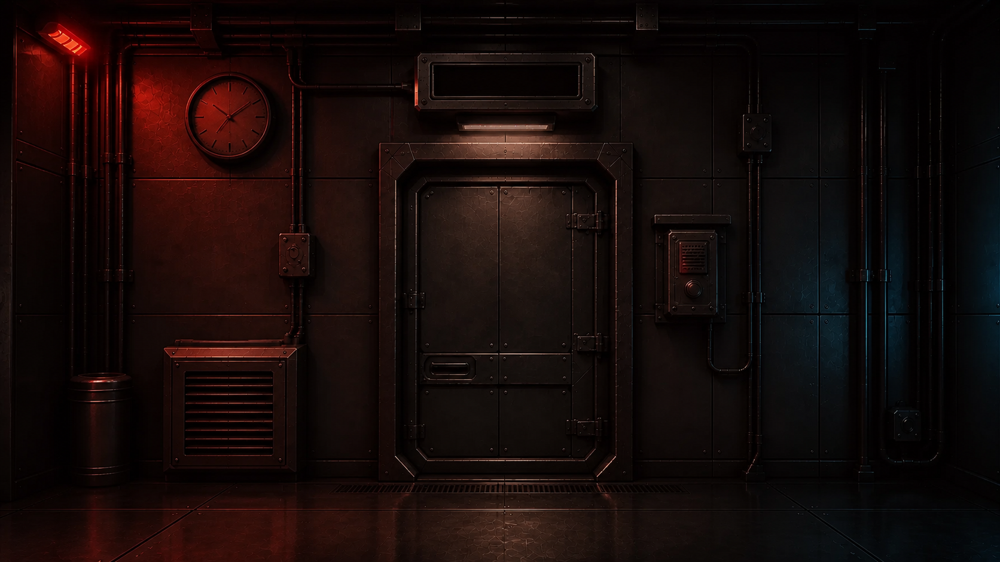

# ECHO ROOM / 残響室



> 閉ざされた実験室。インターホンの声だけが、出口を知っている。

2039年、事故で封鎖された地下研究施設の実験室E-01。非常灯の下で目を覚ましたあなたへ、正体不明の人物から通信が届きます。

室内に残された記録を読み解き、離れた手掛かりをつなぎ、実験設備を動かして出口を開く。Webブラウザで遊べる、20〜30分の一人称SFミステリー脱出ゲームです。

[ブラウザで遊ぶ](https://ivgtr.github.io/echo-room/)

## 開発

```sh
npm ci
npm run dev
```
