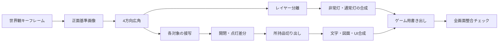

# 『ECHO ROOM / 残響室』グラフィック制作・生成仕様書

## 1. 文書情報

| 項目 | 内容 |
|---|---|
| 文書種別 | グラフィック制作仕様書 / 画像生成依頼書 |
| 対象作品 | ECHO ROOM / 残響室 |
| 版 | 0.1 |
| 作成日 | 2026-08-11 |
| 関連資料 | `docs/base.md`、`docs/requirements.md`、`docs/technical-design.md` |
| 機械可読の依頼定義 | `docs/graphics-generation.yaml` |

本書は、必要なグラフィックを漏れなく洗い出し、同じ世界観と空間構造を維持したまま、画像生成担当へ一式で依頼できる状態にするための仕様である。

「一式で依頼できる」とは、全素材を無関係な画像として同時生成することではない。最初に基準画像を確定し、その画像を参照して別視点、接写、状態差分を順番に作る、一貫した制作ジョブ全体を指す。

---

## 2. 制作方針

### 2.1 固定事項

- 3Dモデルは制作しない。
- すべて2D画像で構成する。
- プレイヤー視点は一人称固定とする。
- 固定視点間の切替、接写、レイヤー視差によって疑似3Dに見せる。
- 実験室は同じ一室として、どの視点でも物の位置と形を一致させる。
- 人物の全身は画面に出さない。
- ホラーの廃墟ではなく、事故直後の稼働中研究施設として描く。

### 2.2 画像生成と手作業の境界

画像生成に向くものは、室内背景、機械外装、机、ロッカー、ドア、小物、表面材、雰囲気の基礎画像である。

次は画像生成へ任せず、正確に制作する。

- 端末内の英語・日本語テキスト
- BATTERYの数字とカウントダウン
- ロッカーの入力数字
- 声紋解析率と結果表示
- フロア図の部屋配置
- メモ本文
- 職員証の氏名、ID、所属
- タイトルロゴとTRANSMISSION COMPLETE
- ホットスポット、カーソル、フォーカス表示
- ノイズ、走査線、点滅、画面揺れなど時間変化する効果

生成画像内の画面、紙、銘板は、文字のない余白または判読不能な仮表示とする。可変する最終テキストはReactのHTML/CSS、固定文書は高解像度の編集可能なラスター画像レイヤーとして重ねる。

### 2.3 SVGを使用しない方針

- SVGはグラフィック素材の制作・配信形式として原則使用しない。
- 図面、ロゴ、アイコン、装飾枠も、高解像度のラスター原本からWebPまたはPNGへ書き出す。
- ボタン、タブ、フォーカス枠、音高補助など、画面サイズや操作状態に応じて変化する単純形状はHTML/CSSで描画する。
- 実行時に連続変化する波形やノイズが必要な場合はCanvas描画を使用できる。
- SVGを例外採用する場合は、ラスターでは品質または操作性を満たせない理由と、実画面での品質比較を記録し、事前承認を必要とする。
- 「正確な形状だから」という理由だけではSVGを採用しない。正確さが必要な固定画像は、編集可能な高解像度ラスター原本で制作する。

### 2.4 一貫性を守る原則

1. 先に部屋の正面基準画像を決める。
2. 次に4方向の広角視点を、基準画像とレイアウト図を参照して作る。
3. 接写は対応する広角視点の画像編集として作る。
4. 開閉・点灯などの差分は、元画像の編集として作る。
5. 同じ機械をテキストプロンプトだけで再生成しない。
6. seed値だけに一貫性を依存せず、確定画像を必ず参照画像に使う。
7. 形状が変わらない状態差分では、未変更部分をピクセル単位で維持する。

---

## 3. ビジュアル・バイブル

### 3.1 世界観

2039年、日本の先端研究所の地下にある小規模な実験室。未来的ではあるが、魔法のような技術ではない。設備は高価な試作機と、長年使われた工業部品が混在する。

空間は機能優先で、コンクリート、塗装鋼板、黒い樹脂、曇った強化ガラス、太い配線、露出した固定金具からなる。事故は発生したばかりで、停電、非常灯、わずかな水漏れはあるが、長期間放棄された廃墟ではない。

### 3.2 美術方向

- 重厚で静かな緊張感を持つ、シネマティックなSF脱出ADVのデジタル背景美術。
- 実写写真そのものではなく、ゲーム背景として形、機能、謎の手掛かりが読み取りやすい精密な2Dコンセプトアート。
- 多角形facetやカクカクした面構成を避け、塗装鋼板、金属trim、樹脂、強化glassを自然な陰影、反射、擦れで描き分ける。
- 安価な3D renderの光沢やplastic感を避け、機械の継ぎ目、留め具、interlock、状態灯、配線を整理して配置する。
- レトロフューチャーではあるが、1970年代風に寄せすぎない。
- アナログなレバー、時計、頑丈なロッカーと、薄型ではない研究用端末を共存させる。
- 表面は使用感を持つが、錆、血、苔、崩壊を主役にしない。
- 小物は少なく、パズル対象の輪郭が背景に埋もれない。
- 左右対称にしすぎず、実用施設らしい配線と設備配置にする。

### 3.3 感情の推移

| 段階 | 印象 | 光 |
|---|---|---|
| 覚醒 | 状況が分からない、静かな緊張 | 暗い赤色非常灯、深い影 |
| 電源復旧 | 観察可能になる、少し安心 | 冷たい白色作業灯、赤色灯が一部残る |
| 隣室の否定 | 空間の前提が崩れる | 影をやや硬くし、奥行きを冷たく見せる |
| 声紋解析 | 機械的な確信 | 端末の青緑光、周囲は抑制 |
| 送信 | 大きな力が動く | 白と青緑の脈動、赤いボタンのみ高彩度 |
| 脱出 | 解放と余韻 | ドアの先から白い光 |

### 3.4 色

| 用途 | 色 | 目安 |
|---|---|---|
| コンクリート | 青みのある暗灰色 | `#30363A` |
| 鋼板 | 緑灰色 | `#48534F` |
| 樹脂・影 | 黒に近い青灰色 | `#11181C` |
| 通常照明 | 冷白色 | `#C9D5D5` |
| 端末発光 | 低彩度の青緑 | `#58B8B0` |
| 非常灯 | 深い赤 | `#9A1F24` |
| 危険・送信ボタン | 鮮明な赤 | `#D42A32` |
| 紙・ラベル | 汚しすぎない灰白色 | `#D5D1C4` |

色値は最終カラーグレーディングの基準であり、生成画像へ完全一致を要求するものではない。

### 3.5 カメラ

- 主人公の目線高は床から約165cm。
- 広角視点は35mm判換算28〜32mm相当。
- 接写は45〜55mm相当。
- 水平を保ち、強いダッチアングルを使わない。
- 極端な魚眼、歪んだ垂直線、過大な前景を避ける。
- プレイヤーの手や身体は原則として写さない。
- 調査対象は画面中央から少しずらし、字幕領域と重ねない。

### 3.6 空間の正解

実験室E-01は、およそ幅5.2m、奥行4.0m、天井高2.7mの長方形として扱う。実際の3Dデータは作らないが、全画像の位置関係を次で固定する。

```text
                         北壁
             ┌─────────────────────┐
             │      鉄製ドア       │
             │ 時計        インターホン│
      西壁   │                     │   東壁
 ブレーカー │                     │ 壁面端末
 ロッカー   │                     │ 解析パネル
             │      デスク         │
             └─────────────────────┘
                         南壁
```

- 開始時は北壁のドアを正面に見る。
- 北壁中央に鉄製ドア、その上に非常ロック・バッテリー表示。
- 北壁右寄りにインターホン。
- 東壁に壁面端末、その脇に開閉可能な解析パネル。
- 南壁にデスク、北西寄りの見える位置にアナログ時計。
- 西壁にロッカーとブレーカーパネル。
- 窓はない。
- E-01の左右は厚い設備壁で、隣室への扉、窓、通路を描かない。

フロア図もこの配置と矛盾させない。

### 3.7 探索密度と環境ドレッシング

通常探索画面は、必須対象だけを孤立させた「操作対象一覧」にしない。一方、難易度をpixel huntingへ依存させず、論理パズルの手掛かりと操作対象は支援技術を含めて確実に到達可能にする。環境ドレッシングは、探索する余地、施設の用途、事故直後の時間性を補うために使い、主要パズルの数や答えは増やさない。

#### 3.7.1 情報階層

| 階層 | 1視点の目安 | 役割 | 視覚・操作規則 |
|---|---:|---|---|
| 必須対象 | 1〜3 | 進行、手掛かり、状態変化 | silhouette、配置、配線の収束、局所contrastで判別する。過剰発光させず、keyboardとaccessibility overlayから必ず到達可能にする |
| 雰囲気調査対象 | 1〜2 | 主人公の短い反応、施設理解、事故の痕跡 | 中contrastで置き、進行flagや所持品を持たせない。選択時は必ず短い反応を返す |
| 非操作ドレッシング | 3〜5 | 密度、scale、用途、視差、生活感 | 低contrastで背景へ統合し、hotspotを設けない。必須対象と同じ発光、反復、入力部を持たせない |

- 1画面の独立したsupporting objectは合計4〜7点を目安とし、自由に動かせる大型家具は1点以下にする。
- 必須対象を隠すのではなく、周囲に機能的な文脈を作る。1280×720相当でも必須対象の輪郭を識別できること。
- 下部24%の字幕領域と外周5%の安全領域へ、必須の数字、紙、lever、buttonを置かない。
- 非操作物はfocus、hover、発光、cursor変化を持たない。雰囲気調査対象は必須対象より弱いfocus表現を使う。
- 4本の反復lever、4桁入力、時計文字盤、裸のscrewdriver、access card、音声波形、赤い送信buttonなど、既存パズル固有の視覚文法をdecoyへ転用しない。
- state差分で動かないドレッシングは全状態・接写で同じ位置を保つ。事故痕跡は「最近まで稼働していた施設」の範囲に留め、廃墟やhorrorへ寄せない。

#### 3.7.2 壁別配置

| 視点 | 非操作ドレッシング | 雰囲気調査対象 | 保護する必須対象 |
|---|---|---|---|
| 北壁 | 左下の空調service unit、天井cable tray、扉前の細い排水溝、壁際の低い密閉utility canister、配管support | 扉枠の新しい擦過痕、battery筐体下の結露跡 | 扉、時計、intercom、空表示筐体 |
| 東壁 | 低い整備stool、床置きcable reel、壁面cooling manifold、蓋付きparts tray、配管support | cradleに戻されていないcalibration probe、端末下の新しい焦げ跡 | blank terminal、閉じた解析panel |
| 南壁 | desk lamp、工具case、rolling side cart、低いwaste bin、束ねたdata cable、椅子 | 閉じた工具case、事故で少しずれた椅子 | desk上のblank paper |
| 西壁 | 壁掛けhose reel、折り畳みstep、低いutility dolly、保護glove、床drain | locker前の短い擦過跡、breakerの破れたinspection seal | lockerと空4桁窓、4-lever breaker |

- free-standing objectは通路中央を塞がず、視点回転時に隣接壁のedge cueと矛盾させない。
- utility canister、parts tray、tool case、dollyには錠、数字、強い状態灯を付けず、所持品が入っていると誤認させない。
- 雰囲気調査対象の台詞は後工程でcontent dataへ追加し、現在の真相、時刻、packet、主要人物設定を先出ししない。

---

## 4. 共通生成プロンプト

画像生成時は、以下の英語プロンプトを全背景・機械素材の先頭へ付与する。個別素材のプロンプトは、この共通部分の後ろへ連結する。

### 4.1 WORLD_PROMPT

```text
ECHO ROOM, a grounded Japanese science-fiction mystery game set in 2039. Interior of a compact underground experimental laboratory in a Japanese advanced research institute, immediately after a containment accident. Utilitarian brutalist architecture, blue-gray concrete, painted steel panels, matte black polymer, reinforced frosted glass, exposed conduits and precise industrial fasteners. A believable mixture of expensive near-future prototype equipment and durable analog controls. Recently occupied and functional, lightly worn but not abandoned. Premium cinematic 2D environment concept art for an intellectual escape adventure, with heavy natural metal surfaces, coherent shadows and restrained reflections. Organize seams, fasteners, interlocks, status lamps and cable paths as meaningful nonverbal information. Highly coherent geometry, readable interactive objects, claustrophobic quiet tension, no characters. Avoid low-poly facets and cheap glossy 3D-render surfaces. Designed as a first-person point-and-click adventure background made from layered 2D images, with clear foreground, midground and background separation.
```

### 4.2 CAMERA_PROMPT_WIDE

```text
First-person standing eye level at 1.65 meters, rectilinear 28–32mm full-frame equivalent lens, level horizon, controlled perspective, 16:9 landscape composition. Leave the lower 24 percent visually quiet enough for subtitle UI. Keep all essential clues away from the outer 5 percent crop-safe margin.
```

### 4.3 CAMERA_PROMPT_CLOSEUP

```text
First-person inspection close-up, rectilinear 45–55mm full-frame equivalent lens, level and readable front-three-quarter view, physically consistent with the supplied room reference. The complete interactive object must remain inside the central 80 percent of the frame. Leave clean space around controls for an HTML interaction overlay.
```

### 4.4 LIGHT_PROMPT_POWERED

```text
Cold neutral overhead work lights are active, with subtle remnants of deep red emergency illumination. Muted blue-gray and green-gray palette, restrained cyan equipment glow, realistic soft shadows, no crushed blacks, clue surfaces remain readable.
```

### 4.5 LIGHT_PROMPT_EMERGENCY

```text
Main power is off. Sparse deep-red emergency lights create pools of light and long soft shadows. Very dark but navigable, with enough midtone detail for game interaction. No horror spotlight, no pure black loss of detail.
```

### 4.6 NEGATIVE_PROMPT

```text
No low-poly facets, no triangulated surface patchwork, no cheap 3D model render aesthetic, no plastic materials, no glossy spaceship corridor, no cyberpunk neon city palette, no fantasy technology, no holograms floating in the room, no steampunk, no military bunker, no hospital, no abandoned ruin, no heavy rust, no vegetation, no cobwebs, no blood, no gore, no body, no monster, no visible person, no protagonist hands, no weapons, no windows, no adjacent-room doorway, no fisheye lens, no Dutch angle, no extreme depth of field, no motion blur, no illegible decorative text, no logos, no watermarks, no UI overlay, no subtitles, no baked-in labels or numbers.
```

### 4.7 生成依頼の組み立て

各ジョブは、次の順に連結する。

```text
WORLD_PROMPT
+ CAMERA_PROMPT_WIDE または CAMERA_PROMPT_CLOSEUP
+ LIGHT_PROMPT_POWERED または LIGHT_PROMPT_EMERGENCY
+ 個別プロンプト
+ NEGATIVE_PROMPT
```

状態差分と接写ではさらに次を追加する。

```text
Use the supplied approved reference image as the single source of truth.
Preserve unchanged geometry, materials, proportions, camera placement and object identity.
Do not redesign the room or the machine.
```

---

## 5. サイズ・ファイル仕様

### 5.1 サイズ区分

| 区分 | 制作原本 | ゲーム用書き出し | 比率 | 用途 |
|---|---:|---:|---:|---|
| 広角背景 | 3840×2160以上 | 1920×1080 | 16:9 | 4方向の通常探索 |
| 接写背景 | 2560×1440以上 | 1920×1080 | 16:9 | ドア、端末、ロッカー等 |
| 全画面演出 | 3840×2160以上 | 1920×1080 | 16:9 | タイトル、ドア開放、白飛び |
| 全画面透明レイヤー | 1920×1080以上 | 1920×1080 | 16:9 | 前景、影、光、配線 |
| 単体プロップ | 長辺2048以上 | 内容に応じ最大2048 | 任意 | レバー、扉、工具など |
| 所持品詳細 | 2048×2048以上 | 1024×1024 | 1:1 | 所持品拡大 |
| 所持品アイコン | 詳細画像から作成 | 256×256 | 1:1 | 一覧表示 |
| 職員証写真 | 1024×1280以上 | 512×640 | 4:5 | 声紋解析、職員証 |
| 紙・カード面 | 長辺2048以上 | 長辺1024〜2048 | 元形状 | 文書・職員証 |
| サムネイル | 原本から作成 | 320×180 | 16:9 | 会話履歴等で必要な場合のみ |

- 画像生成サービスが指定寸法を直接出せない場合は、16:9または最も近い横長比率で最大サイズを生成し、構図を変えずに拡張・クロップして制作原本へ合わせる。
- 単純な引き伸ばしは禁止する。
- 生成時から上下左右10%程度の余裕を持ち、最終クロップで主要対象を切らない。

### 5.2 ファイル形式

| 段階 | 形式 |
|---|---|
| 生成直後 | 生成サービスの無劣化または最高品質形式 |
| 編集原本 | レイヤーを保持できる形式 |
| 背景配信 | WebP、品質確認後に圧縮 |
| 透明素材配信 | lossless WebPまたはPNG |
| 図面・ロゴ・アイコン | 高解像度PNG原本からWebPまたはPNGへ書き出し |
| マスク | 8bitグレースケールPNG |

### 5.3 安全領域

- 外周5%には必須の手掛かりを置かない。
- 画面下24%は字幕が重なる前提とし、重要なボタンや数字を置かない。
- 画面右上8%は設定ボタンなどのHUD候補領域とする。
- 接写画面では対象物全体を中央80%へ収める。
- スマートフォン横向きで左右が少し狭くなっても、必須対象が欠けない構図にする。

---

## 6. レイヤー納品仕様

広角背景は、最低限次のレイヤーへ分けて納品する。

```text
<view_id>/
├── preview_flat.png
├── background.webp
├── far_props.webp
├── main_props.webp
├── foreground.webp
├── emissive_mask.png
├── shadow_overlay.webp
├── emergency_light_mask.png
└── source_layered.<editable>
```

- 各レイヤーは1920×1080の同じCanvas原点を持つ。
- 透明部分を自動トリミングしない。
- レイヤーをすべて重ねると`preview_flat.png`と一致する。
- 発光面は`emissive_mask`へ白、非発光面は黒で示す。
- 非常灯の影響範囲は`emergency_light_mask`で分ける。
- 視差で穴が見えないよう、背後レイヤーを完成画面より3〜5%広く描き足す。

接写の可動物は、次の状態を同じ座標で納品する。

```text
<object_id>/
├── base.webp
├── state_closed.webp
├── state_open.webp
├── movable_part.webp
├── hit_mask.png
└── preview_states.png
```

---

## 7. 必要素材一覧

### 7.1 基準資料

| ID | 素材 | 生成方法 | 優先度 |
|---|---|---|---|
| GFX-REF-001 | 美術方向キーフレーム | 新規生成、最初に承認 | 必須 |
| GFX-REF-002 | E-01正面の基準画像 | REF-001参照で生成 | 必須 |
| GFX-REF-003 | 主要素材・色・表面のシート | REF-002から切り出し・整理 | 必須 |
| GFX-REF-004 | 部屋レイアウト図 | 人手で正確に作図 | 必須 |

### 7.2 通常探索の広角背景

| ID | 視点 | 主な対象 | 状態 |
|---|---|---|---|
| GFX-WIDE-001 | 北壁 | ドア、時計、インターホン | 基準となる正面視点 |
| GFX-WIDE-002 | 東壁 | 壁面端末、解析パネル | 電源OFFを基礎状態とする |
| GFX-WIDE-003 | 南壁 | デスク、紙、椅子、配線 | 紙を取得前の状態 |
| GFX-WIDE-004 | 西壁 | ブレーカー、ロッカー | ロッカー閉状態 |
| GFX-WIDE-005 | 北壁終幕 | 開いたドアと白い光 | WIDE-001の編集差分 |

非常灯状態と電源復旧状態を別々に再生成せず、基礎背景、発光マスク、影、カラーグレーディングから作る。これにより物体の位置を維持する。

### 7.3 接写背景

| ID | 対象 | 必要状態・用途 |
|---|---|---|
| GFX-CLOSE-001 | 鉄製ドア | 閉、ロック解除、少し開く |
| GFX-CLOSE-002 | アナログ時計 | 02:17で停止。文字盤数字は後工程で重ねる |
| GFX-CLOSE-003 | インターホン | 通信なし、受信中ランプ |
| GFX-CLOSE-004 | デスク | 紙あり、紙取得後 |
| GFX-CLOSE-005 | ブレーカーパネル | 4レバーOFF、操作可能状態 |
| GFX-CLOSE-006 | ロッカー | 閉、開、内容物あり、回収後 |
| GFX-CLOSE-007 | ロッカー電子錠 | 空の表示窓、数字はDOMで重ねる |
| GFX-CLOSE-008 | 壁面端末 | 電源OFF、起動中、ON。画面内容はDOMで重ねる |
| GFX-CLOSE-009 | 端末横パネル | 閉、ドライバーで開いた状態 |
| GFX-CLOSE-010 | VOICE ANALYSISスイッチ | OFF、ON |
| GFX-CLOSE-011 | 最終送信装置 | 4スロット、赤い送信ボタン |
| GFX-CLOSE-012 | ドアの先 | 白い光が満ちる前室の入口のみ |

### 7.4 所持品と文書

| ID | 素材 | 生成・制作方法 |
|---|---|---|
| GFX-ITEM-001 | ドライバー | 透明背景の単体生成、施設備品らしい使用感 |
| GFX-ITEM-002 | 職員用カード表面 | カード外装を生成し、文字と写真は後合成 |
| GFX-ITEM-003 | 主人公の職員証写真 | キャラクター設定確定後に生成 |
| GFX-ITEM-004 | 折り畳まれたフロア図 | 紙の外観を生成 |
| GFX-DOC-001 | 展開したフロア図 | 高解像度の編集可能なラスター原本で正確に作図し、生成した紙textureへ合成 |
| GFX-DOC-002 | 非常電源テスト用紙 | 紙textureを生成し、本文は後合成 |
| GFX-DOC-003 | 緊急時メモ | 紙textureと手書き線の雰囲気を作り、本文は後合成 |
| GFX-DOC-004 | ECHO研究概要 | 端末DOMとして制作。画像生成なし |

### 7.5 UI外装と演出素材

| ID | 素材 | 方針 |
|---|---|---|
| GFX-UI-001 | 端末の画面ベゼル | CLOSE-008から切り出し、9-slice可能に整理 |
| GFX-UI-002 | 所持品トレイ背景 | 鋼板と半透明黒を基に人手で制作 |
| GFX-UI-003 | 会話ログ外装 | UIとして人手で制作 |
| GFX-UI-004 | ボタン・タブ・フォーカス | HTML/CSSで制作 |
| GFX-UI-005 | 音高視覚補助 | HTML/CSSまたはCanvasで制作 |
| GFX-FX-001 | 微細な埃 | 透明textureを生成または手作業で制作 |
| GFX-FX-002 | 水滴の跡 | 背景用の透明差分 |
| GFX-FX-003 | 白飛びtexture | グラデーションとして人手で制作 |
| GFX-FX-004 | 端末ノイズ | 実行時生成。画像生成なし |
| GFX-FX-005 | 非常灯の光 | maskと実行時合成。独立した完成画像にしない |

### 7.6 タイトル・告知用

| ID | 素材 | サイズ | 方針 |
|---|---|---:|---|
| GFX-TITLE-001 | タイトル背景 | 3840×2160 | WIDE-001を基に暗く再構成 |
| GFX-TITLE-002 | ECHO ROOMロゴ | 4096×1024以上の透過ラスター原本 | 人手でタイポグラフィ制作 |
| GFX-PROMO-001 | 横長キービジュアル | 3840×2160 | タイトル背景から派生 |
| GFX-PROMO-002 | 正方形サムネイル | 2048×2048 | キービジュアルから再構成 |
| GFX-PROMO-003 | OGP画像 | 1200×630 | ロゴとキービジュアルを合成 |

告知素材には「声の主が未来の自分」という真相を描かない。

---

## 8. 個別プロンプトの管理

全個別プロンプト、参照関係、寸法、納品物は`docs/graphics-generation.yaml`を正本とする。本書とYAMLで差異がある場合は、ID、寸法、生成順についてYAMLを優先する。

各素材の個別プロンプトには、次だけを書く。

- 画面に何があるか
- どの方向を向いているか
- 何を読みやすくするか
- 元画像から何を変えるか
- 何を変えてはいけないか

世界観や共通禁止事項を個別プロンプトへ複製しない。修正時に全素材へ差が出るためである。

---

## 9. 一気通貫の生成手順



### Stage 0：事前入力

生成開始前に次を決める。

- 主人公の職員証写真に必要な外見設定
- 研究所ロゴを作るか、文字だけにするか
- 画面上の最終フォント
- 画像生成サービスが受け取れる参照画像数と最大寸法

未決定でも環境素材は作れるが、GFX-ITEM-003は保留する。

### Stage 1：基準承認

1. GFX-REF-001を3案生成する。
2. 世界観、密度、色、怖さの程度を確認し1案を選ぶ。
3. 選択案からGFX-REF-002を作る。
4. 部屋配置を人手で修正し、正面基準画像を承認する。

この承認前に接写や別視点を量産しない。

### Stage 2：空間展開

- REF-002とREF-004を参照し、WIDE-001〜004を作る。
- 各画像を並べ、ドア、時計、端末、机、ロッカー、配線の接続位置を確認する。
- 矛盾があれば接写へ進まず、広角側を修正する。

### Stage 3：接写と状態差分

- 各接写は対応する広角画像を参照して編集する。
- 開閉差分ではカメラと未変更部分を固定する。
- 可動部、影、発光面、入力画面をレイヤーへ分ける。

### Stage 4：正確な情報の合成

- 端末表示、時計数字、メモ、フロア図、職員証、タイトルを合成する。
- 実際にゲームで使う文言と照合する。
- 02:17、02:37、-00:20:00などの時刻を二重確認する。

### Stage 5：書き出しと検収

- 原本、runtime画像、mask、flattened previewを納品する。
- ファイル名とmanifestのIDを一致させる。
- WebP圧縮前後の差を確認する。
- ゲーム画面へ仮配置し、字幕、安全領域、ホットスポットを確認する。

---

## 10. ファイル命名規則

```text
<asset-id>__<state>__<layer>__<size>.<ext>
```

例:

```text
gfx-wide-001__powered__background__1920x1080.webp
gfx-wide-001__powered__foreground__1920x1080.webp
gfx-close-006__open__main__1920x1080.webp
gfx-item-001__default__main__1024x1024.webp
gfx-wide-001__emergency__emissive-mask__1920x1080.png
```

- 英小文字、数字、ハイフンのみを使用する。
- `final`、`new`、`fix2`のような状態不明の語を使わない。
- 修正版はファイル名を増やさず、原本のversion管理で追跡する。
- runtimeファイル名はmanifestから機械的に生成できる形にする。

---

## 11. 生成結果の検収基準

### 11.1 全画像共通

- E-01が同じ部屋として認識できる。
- 物体の位置、材質、寸法感が別視点で矛盾しない。
- 窓や隣室へ通じる開口部が追加されていない。
- 生成由来の文字、ロゴ、透かしが残っていない。
- ホラー、宇宙船、サイバーパンクへ寄りすぎていない。
- 必須対象が字幕や外周cropで隠れない。
- 暗い状態でも調査対象の輪郭が判別できる。
- 人物、手、武器が写っていない。

### 11.2 広角画像

- 4方向を並べると配置図と一致する。
- 同じ壁の端部、配線、床目地が隣の視点へ自然につながる。
- 背景、主要物、前景に分離できる奥行きがある。
- 視差用に動かしても未描画の穴が見えない。

### 11.3 接写と差分

- 広角画像と同一の物体である。
- 操作部が中央80%以内に収まる。
- 開閉前後で本体、照明、カメラ位置がずれない。
- DOMで重ねる数字や文字のための平らな余白がある。
- hit maskを対象物の輪郭に合わせられる。

### 11.4 物語上の確認

- 時計は最終合成で02:17を示す。
- 端末とロッカーは0237の謎を妨げない。
- フロア図にE-01の隣室が存在しない。
- 赤い送信ボタンは終盤以前に過度に目立たない。
- タイトルや告知画像が真相をネタバレしない。

---

## 12. 生成依頼時の納品物

画像生成担当への一括依頼には、次を含める。

1. `docs/graphics-production.md`
2. `docs/graphics-generation.yaml`
3. 承認済みGFX-REF-001〜004
4. 各生成ジョブの元画像とmask
5. 生成された無加工原本
6. レイヤー分離済み編集原本
7. runtime用WebP/PNG
8. assetごとの生成モデル名、設定、seed、参照画像、生成日を記録したログ
9. 検収結果と未解決事項

生成サービスがseedや一部設定を提供しない場合は、取得可能な範囲で記録し、参照画像を再現性の中心とする。

---

## 13. 現時点の保留事項

| ID | 保留内容 | 影響する素材 |
|---|---|---|
| G-D01 | 主人公の氏名、年齢、性別表現、髪型、服装 | 職員証写真、職員証 |
| G-D02 | 研究所の正式ロゴ | 職員証、端末外装、タイトル周辺 |
| G-D03 | 最終フォント | 端末、文書、ロゴ、字幕との調和 |
| G-D04 | 生成サービス | 直接生成サイズ、参照画像上限、透明画像の品質 |
| G-D05 | 告知素材の必要範囲 | PROMO-001〜003 |

保留項目は環境背景の開始を妨げない。該当素材だけを保留し、後工程で差し替えられる構造にする。
