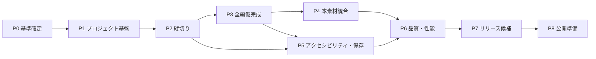

# 『ECHO ROOM / 残響室』実装計画・実行契約書

## 1. 文書情報

| 項目 | 内容 |
|---|---|
| 文書種別 | 実装計画書 / 実行契約書 |
| 対象作品 | ECHO ROOM / 残響室 |
| 版 | 0.1 |
| 作成日 | 2026-08-11 |
| 想定用途 | 人または実装エージェントが、着手から公開可能状態まで一気通貫で進めるための基準 |

### 1.1 正本となる資料

| 領域 | 正本 |
|---|---|
| 原案・台詞 | `docs/base.md` |
| ゲーム要件 | `docs/requirements.md` |
| 技術構成 | `docs/technical-design.md` |
| UI品質 | `docs/quality-up-plan.md` |
| グラフィック制作 | `docs/graphics-production.md` |
| 画像生成ジョブ | `docs/graphics-generation.yaml` |
| 実装順序・完了判定 | 本書 |

本書の「契約」は法的契約ではなく、実装中の判断、品質、進行、報告の約束を指す。

---

## 2. 計画の目的

この計画は、次を実現する。

1. 技術基盤だけを作って止まらず、冒頭からエンディングまで完成させる。
2. 各工程の開始条件、成果物、検証方法、完了条件を明確にする。
3. 本番画像や音声が未完成でも、代替素材によって実装を継続できるようにする。
4. ストーリー、パズル、疑似3D描画、アクセシビリティ、保存、テストを別々の未接続機能にしない。
5. 「実装済み」と「完成済み」を区別し、検証なしの完了宣言を防ぐ。
6. 後から担当者が変わっても、同じ判断基準で継続できる状態を残す。

---

## 3. 実行契約

### 3.1 開始の合意

今後、依頼者が「実装計画書に従って実装を進める」と指示した場合、実装担当は本書の順序と判断基準に従い、未完了の最上位工程から作業を開始する。

その指示によって許可されるのは、リポジトリ内の実装、設定、テスト、文書更新、ローカル検証である。次は別途明示的な許可を必要とする。

- 外部サービスの契約や課金
- 本番環境への公開
- 外部リポジトリへのpushやPull Request作成
- 分析、広告、外部エラー収集サービスの導入
- マイク、カメラなど端末権限の追加
- ストーリーの真相、結末、主要人物設定の変更

### 3.2 実装担当の義務

実装担当は次を守る。

- 未完了の依存関係を確認し、実行可能な最優先タスクから着手する。
- 安全な範囲では合理的な既定値を採用し、軽微な判断のために作業を止めない。
- 本番素材がなくても、同じIDと寸法を持つ代替素材で進行を完成させる。
- 変更した範囲に応じたテストを実行し、結果を確認してから完了とする。
- 失敗した検証を隠さず、再現条件と残作業を記録する。
- 既存資料と実装が食い違った場合、どちらかを黙って放置せず同じ作業内で整合させる。
- スコープ外の機能を、将来使うかもしれないという理由だけで追加しない。
- プレイヤーに見える仮素材、仮文言、デバッグ導線を完成版へ残さない。

### 3.3 依頼者側で必要な判断

次の判断が未確定でも、該当部分以外は進める。

| 判断 | 決まるまでの扱い | 止まる範囲 |
|---|---|---|
| 主人公の属性 | `protagonist_unknown`と仮写真枠を使用 | 職員証写真と最終人物表現のみ |
| 研究所ロゴ | 文字のみの仮表記 | 本番ロゴ合成のみ |
| 最終フォント | system fontを仮使用 | 最終タイポグラフィ調整のみ |
| 画像生成サービス | Canvas製の寸法付き代替画像を使用 | 本番グラフィック生成のみ |
| 発話音声 | 使用しない | 保留せず、字幕と声紋データ演出に固定 |
| 告知素材 | 制作しない | 公開告知のみ。本編完成は止めない |

### 3.4 停止条件

次の場合だけ、該当作業を止めて判断を求める。

- 要件の解釈によって真相、結末、必須パズルが変わる。
- 新たな課金、外部公開、個人情報、端末権限が必要になる。
- 資料間の矛盾に複数の妥当な解決があり、選択でプレイヤー体験が大きく変わる。
- 既存の利用者データを失う変更が必要になる。
- 対象範囲を大きく超える作り直しが必要になる。

画像、音声、人物設定が未確定であることだけを理由に、基盤や仮素材で進められる工程を止めない。

### 3.5 完了報告の契約

各作業の報告には最低限、次を含める。

```text
完了した成果:
変更した主なファイル:
実行した検証と結果:
代替素材・仮実装:
残課題または次の工程:
```

テスト未実行の場合は「未実行」と理由を明記する。「問題なし」という表現だけで代用しない。

### 3.6 コミット契約

実装担当は、作業を後から安全に確認・復元できるよう、ローカルGitコミットを適切な区切りで作成する。

#### コミットするタイミング

- 1つの作業パッケージがDefinition of Doneを満たしたとき。
- Phase Gateを通過したとき。
- 大きなリファクタリングや保存形式変更など、影響の大きい作業へ入る直前。
- 長い作業で、単独でも意味があり検証可能な縦切りが完成したとき。
- 不具合修正と、その再発防止テストが揃ったとき。

長時間の作業を1コミットへ詰め込まず、逆に同じ目的の数行変更を意味なく細分化しない。1コミットは、原則として1つの目的を説明でき、単独でbuildまたは対象検証が通る大きさとする。

#### コミット前の確認

1. `git status`と差分を確認する。
2. 自分の作業対象だけをstageする。
3. 利用者または別作業の既存変更を混ぜない。
4. 変更範囲に必要なtypecheck、lint、test、validationを実行する。
5. secret、生成cache、不要な大容量ファイル、debug出力が含まれていないことを確認する。
6. 仕様変更がある場合は、関連文書と進捗記録も同じコミットへ含める。

#### コミットメッセージ

```text
<type>(<scope>): <変更目的>
```

推奨する`type`は次の通り。

| type | 用途 |
|---|---|
| `feat` | プレイヤー向け機能 |
| `fix` | 不具合修正 |
| `test` | テスト追加・修正 |
| `refactor` | 動作を変えない構造改善 |
| `docs` | 文書のみの変更 |
| `build` | build・依存・開発環境 |
| `chore` | 上記以外の保守作業 |

メッセージは、変更ファイル名ではなく、達成した目的が分かるように書く。例:

```text
feat(power): 非常電源パズルと復旧遷移を実装
test(save): 電源復旧チェックポイントの復元を検証
docs(plan): Phase 2の検証結果を記録
```

#### 禁止事項と権限境界

- 検証に失敗した状態を、作業退避以外の完成コミットとして残さない。
- `--no-verify`で必須検証を回避しない。
- 利用者の変更を無断で取り消し、上書き、まとめ直ししない。
- 既存コミットのamend、rebase、squash、履歴書換えは、明示的な依頼なしに行わない。
- remoteへのpush、Pull Request作成、release tag作成は、明示的な許可なしに行わない。
- 大容量の制作原本を通常Gitへ追加する必要が生じた場合は、Git LFS等の管理方針を決めるまで追加しない。

完了報告には、作成したコミットhashとメッセージを記載する。コミットできなかった場合は、その理由と未コミットの差分範囲を明記する。

---

## 4. 仕様の優先順位と変更管理

### 4.1 優先順位

矛盾がある場合は次の順で判断する。

1. 依頼者の最新の明示的な指示
2. `docs/requirements.md`の体験・受け入れ条件
3. `docs/technical-design.md`の技術上の制約
4. `docs/graphics-production.md`と`docs/graphics-generation.yaml`の素材制約
5. `docs/quality-up-plan.md`のUI品質方針
6. 本書の工程と実行方法
7. `docs/base.md`の細部

ただし、原案の真相と結末は要件書と同等の固定事項として扱い、技術上の都合で変更しない。

### 4.2 変更区分

| 区分 | 例 | 扱い |
|---|---|---|
| 軽微 | 名前、配置、内部関数分割、テスト補助 | 実装中に判断し、必要なら文書を更新 |
| 通常 | UI構成、データ項目、素材分割、ヒント文 | 要件を満たす範囲で実装し、変更理由を記録 |
| 重大 | 技術基盤変更、パズル削除、対応環境縮小 | 着手前に依頼者へ確認 |
| 禁止 | 3Dモデル化、SVGの標準採用、結末変更、マイク必須化 | 明示的な要件変更なしに実施しない |

### 4.3 決定記録

次に該当する判断は`docs/decisions/`へ短い決定記録を追加する。

- 主要依存技術の追加・置換
- 保存形式の非互換変更
- 対応ブラウザの変更
- 性能予算を超える判断
- 本書の禁止事項を例外的に許可する判断
- SVGを例外採用する判断

決定記録には、背景、決定、代替案、影響を記載する。

---

## 5. 実装の固定条件

### 5.1 プロダクト

- 1人用、初見20〜30分の短編脱出ゲーム。
- 舞台は実験室E-01を中心とする。
- 大きな真相は「通信相手は20分後の主人公自身」の一点。
- 最後はプレイヤーが4つの文章PACKETを過去へ送って因果を完成させる。
- 証拠収集、関係推理、設備検証を持つ主要7問を省略しない。同じ推理を別問へ分割しない。
- 20分経過は即ゲームオーバーにせず、非常予備電源へ移行する。

### 5.2 表現

- 2D画像による一人称・疑似3D探索。
- 3Dモデル、3D空間、自由歩行を導入しない。
- SVGをグラフィック素材の標準形式として使わない。
- 本番グラフィックは高解像度ラスター原本からWebPまたはPNGへ書き出す。
- 可変UIはHTML/CSS、時間変化する一部表現はCanvasで描画する。
- 生成画像へ正確な文字を焼き込まない。

### 5.3 技術

- TypeScript 5系、strict。
- Vite 8系、React 19系、PixiJS 8系、XState 5系。
- Zod、Web Audio API、Vitest、Playwright。
- Node.js 24 LTS、npm 11系。
- 静的ホスティングで完結し、バックエンドを持たない。
- ゲーム状態はXStateに一元化する。
- ReactとPixiJSは状態を直接変更せず、型付きイベントを送る。
- 保存用データはXStateの内部snapshotをそのまま永続化しない。

### 5.4 品質

- マウス、タッチ、キーボードで必須進行を完了可能にする。
- 音声なしでも字幕と視覚補助でクリア可能にする。
- 一時停止、画面非表示中はアクティブ時間を進めない。
- 一般的なデスクトップと横向きモバイルを対象とする。
- コンテンツ、素材参照、時刻、台詞の整合を自動検証する。

---

## 6. 実装戦略

### 6.1 縦切り優先

描画基盤をすべて作ってから物語を載せるのではなく、最初に次の縦切りを完成させる。

```text
タイトル
  -> ゲーム開始とサウンド解放
  -> 暗い北壁の探索
  -> ブレーカーへ移動
  -> 非常電源パズル
  -> 電源復旧
  -> 端末起動
  -> 自動保存
  -> 再読込から復元
```

この縦切りに、PixiJS、React、XState、音声、字幕、入力、保存、代替素材、テストをすべて通す。以後のパズルは同じ経路を拡張する。

### 6.2 代替素材優先

- 本番画像の代わりに、実行時Canvasで寸法、ID、状態名を描く代替素材を使う。
- 代替素材も本番と同じasset ID、Canvas寸法、alphaの有無を持つ。
- 仮のテキストファイル名を直接画面コードへ書かない。
- 本番素材への置換はmanifestの参照先変更だけで完了させる。
- 台詞は字幕だけで提示し、発話音声の再生完了に進行を依存させない。
- 代替素材の利用状況を一覧化し、リリース検査でゼロ件を必須とする。

### 6.3 コンテンツ先行検証

画像や音声より先に、次をデータとして確定する。

- chapter、location、hotspot、item、dialogue、audio、puzzle、hintのID
- 全台詞と4つのPACKET
- 02:17、02:37、-00:20:00を含む時刻
- パズルの正解、誤答、完了効果
- 必須進行フラグ
- 自動保存チェックポイント

IDは本番素材完成後も変更しない。

---

## 7. 全体工程



| Phase | 名称 | 主成果 | 依存 |
|---|---|---|---|
| P0 | 基準確定 | 決定表、ID台帳、受け入れ環境 | なし |
| P1 | プロジェクト基盤 | 起動可能な空のゲーム、CI、検証コマンド | P0 |
| P2 | 縦切り | 開始から電源復旧・再開まで | P1 |
| P3 | 全編仮完成 | 仮素材でエンディングまで通る | P2 |
| P4 | 本素材統合 | 本番画像、音声、演出 | P2、素材承認 |
| P5 | 遊びやすさ | 保存、ヒント、全入力、アクセシビリティ | P2、P3 |
| P6 | 品質・性能 | 全自動検証、対象環境合格 | P4、P5 |
| P7 | リリース候補 | 完成版候補、既知問題一覧 | P6 |
| P8 | 公開準備 | 配信成果物、公開・ロールバック手順 | P7 |

Phase番号は順序を示す。P4の素材制作とP5の機能調整は、依存条件を満たした範囲で並行可能とする。

---

## 8. Phase別実装計画

### P0：基準確定

#### P0-01 資料整合

**作業:**

- 全資料の参照関係を確認する。
- 固定条件と保留条件を`project-decisions`へ整理する。
- 同じ概念のID命名規則を決める。

**成果物:**

- `docs/implementation-plan.md`
- 初期決定表
- ID命名規則

**完了条件:**

- 実装を止める未解決事項と、代替で進められる事項が分離されている。
- 本書5章の固定条件に矛盾がない。

#### P0-02 開発環境基準

**作業:**

- Node.js、npm、対象ブラウザを固定する。
- 開発、テスト、ビルドのコマンド名を決める。

**完了条件:**

- 新しい環境でREADMEの手順だけから起動できる基準が定義されている。

---

### P1：プロジェクト基盤

#### P1-01 Scaffold

**作業:**

- Vite + React + TypeScriptのプロジェクトを作成する。
- strictなTypeScript設定、lint、format、テストを設定する。
- PixiJS CanvasとReactの重ね合わせを作る。
- XState actorをアプリケーション起動時に1つ生成する。

**成果物:**

- タイトルから空のプレイ画面へ移動できるアプリ
- 開発・本番ビルド
- エラー境界と非対応環境画面

**完了条件:**

- `npm run dev`で起動する。
- `npm run build`、`npm run typecheck`、`npm run test`が成功する。
- ReactとPixiJSが別々のゲーム状態を持っていない。

#### P1-02 Repository contract

次のscriptを提供する。

| Command | 契約 |
|---|---|
| `npm run dev` | ローカル開発を開始する |
| `npm run build` | 本番用静的成果物を作る |
| `npm run preview` | 本番成果物をローカル確認する |
| `npm run typecheck` | TypeScriptの型を検査する |
| `npm run lint` | コード品質規則を検査する |
| `npm run test` | 単体・状態遷移テストを実行する |
| `npm run test:e2e` | Playwrightの通しテストを実行する |
| `npm run validate:content` | コンテンツと物語整合を検証する |
| `npm run validate:assets` | asset ID、寸法、参照、代替素材を検証する |
| `npm run check` | 公開前の必須検証をまとめて実行する |

`npm run check`は少なくともtypecheck、lint、content、asset、unit test、buildを含む。E2Eを分ける場合はCIの必須jobとして実行する。

#### P1-03 CI

**作業:**

- lockfileを用いた再現可能なinstall。
- `npm run check`と主要E2Eを自動実行。
- build成果物の容量を記録。

**完了条件:**

- 新規clone相当の環境で全必須checkが成功する。
- check失敗時に公開工程へ進まない。

---

### P2：縦切り

#### P2-01 画面骨格

- 1920×1080の論理Canvas。
- 16:9維持、レターボックス、横向きモバイル。
- Canvas、字幕、HUD、modal、system layer。
- マウス、タッチ、キーボード入力の共通イベント化。
- 動き軽減の初期対応。

#### P2-02 代替Room

- 北・東・南・西の4視点を代替素材で表示。
- hotspotを選択し、視点移動と接写から戻れる。
- 開発時だけhotspot境界とIDを表示。
- PixiJS accessibility overlayを検証。

#### P2-03 導入

- 暗転、赤い非常灯、BATTERY 00:19:48。
- 最初の会話と字幕。
- サウンド開始のユーザー操作。
- 現在目的「電源を戻す」。

#### P2-04 非常電源パズル

- 非常電源の容量、設備負荷、短絡線を提示する。
- 損傷線の隔離と3設備の給電順を一括判定する。
- 誤答時は保護回路の作動理由を返し、再試行可能にする。
- 無音で全情報を確認できる。
- 成功時の照明、端末、会話の状態変化。

#### P2-05 保存・復元の縦切り

- 電源復旧直後の自動保存。
- 再読込後の復元。
- 演出と音声を二重再生しない。
- 保存破損と書込失敗の表示。

#### P2 Gate

次をすべて満たすまでP3の量産へ進まない。

1. タイトルから端末起動まで操作できる。
2. マウス、タッチ、キーボードで同じ結果になる。
3. 音声を無効化しても字幕で進行できる。
4. 再読込後に安全な地点から再開できる。
5. 状態変化がXStateイベントとして記録される。
6. 縦切りのE2Eが安定して成功する。

---

### P3：全編仮完成

このPhaseでは演出品質より、全因果関係を先に完成させる。

#### P3-01 コンテンツschema

- scene、hotspot、dialogue、item、document、puzzle、hint、assetのZod schema。
- YAML読込と参照検証。
- 条件・効果の許可リスト。
- 任意コード実行の禁止。

#### P3-02 端末

- SYSTEM、LOG、SIGNAL、SECURITY。
- 進行に応じたlock表示。
- 重要情報の再確認。
- 英語表示と日本語補助。

#### P3-03 Puzzle 1〜3

- 容量と短絡を扱う非常電源経路。
- 波形の共通文法を導入する搬送波同期。
- 点検順を機器に刻まれた記号へ変換するロッカー。
- ドライバー、職員証、施設図の取得。

#### P3-04 Puzzle 4〜7

- 別順のRECEIVE・SOURCEを指紋で照合し、結果として20分差を示す。
- 施設図に通信の配線を重ね、ECHO BUFFER RETURNまで追跡する。
- PACKET断片を波形連続性から復元する。
- 発言と既発生イベントを照合し、未来PACKETを特定する。

#### P3-05 Puzzle 8

- ドライバーで端末横のパネルを開く。
- 間隔、包絡、位相の三特徴を手動校正する。
- 全特徴一致の結果としてE-01 OCCUPANTと主人公写真を表示する。
- 正体判明会話。

#### P3-06 Puzzle 9〜10とEnding

- 設備状態を根拠に因果会話を再構成する。
- 4受信枠、-00:20:00、ECHO BUFFER RETURNを組み合わせる。
- 試験送信成功後だけ赤いボタンを有効化する。
- 過去の自分との冒頭会話再現。
- ドア解錠、白い光、タイトル、TRANSMISSION COMPLETE。

#### P3-07 ヒント

- 各パズルに3段階のヒント。
- 誤答回数または停滞で利用可能を通知。
- 利用は任意で、評価や結末に影響しない。

#### P3 Gate

1. 代替画像・字幕のみでも冒頭からエンディングまで到達できる。
2. 各パズルの正解と誤答を単体テストできる。
3. 正規ルートと再開ルートのE2Eが成功する。
4. 20分差、PACKET文言、冒頭・終盤会話の自動検証が成功する。
5. 先回り入力や重複操作で必須イベントを飛ばせない。

#### P3R-01 10問再設計への単一移行（P3B-01で置換済み）

- 旧7問のevent、stage、専用component、正解判定、保存fieldを削除する。
- 当時の10個の`PuzzleDefinition`と単一`PUZZLE_SUBMITTED`eventへ統合する。
- 波形を搬送波、PACKET指紋、声紋特徴量の共通文法として実装する。
- 進行schemaをv3へ更新し、旧schemaの変換層を持たない。
- 当時の10問の正誤、再試行、保存、keyboard、無音ルートを検証する。

commit例:

```text
feat(puzzles): 10問の因果パズルへ再構成
```
6. 進行不能となる状態がない。

#### P3R-02 ゲーム内日本語の平易化

- 謎の情報量と正解は変えず、タイトル、説明、手掛かり、設問、誤答文を短く自然な日本語へ直す。
- 専門語は世界観に必要な固有名へ絞り、初出時は平易な言い換えを添える。
- 目的、ヒント、端末、探索文、資料、所持品、通知で同じ対象を同じ言葉で呼ぶ。
- 誤答文では、見直す条件を具体的に示す。
- keyboardで参照するアクセシブル名とE2Eを新しい文言へ合わせる。

commit例:

```text
refactor(content): ゲーム内の日本語を平易化
```

#### P3R-03 探索と謎の再接続

- 共通Puzzle UIから解法を要約した手掛かり一覧と`PUZZLE 01`形式のゲーム外表示を削除する。
- 装置には現在値と入力部だけを残し、規則を机の資料、機器銘板、会話履歴、別端末項目へ分散する。
- 机の資料を進行に応じて停電時の復旧手順、波形調整メモ、日常文として書かれた夜勤メモへ切り替える。
- ロッカーの四記号を端末、インターホン、転送装置の回路、ドアに刻まれた記号から取得できるようにする。
- 正解後の短いNarrativeを全10問に設け、設備変化と次の異変を画面に表示する。
- 端末は再開時と問終了後にSYSTEMへ戻し、LOG、SIGNAL、SECURITYをプレイヤーが選ぶ。

commit例:

```text
refactor(gameplay): 探索から謎へつながる導線を再構成
```

#### P3R-04 謎UIの装置直接操作化

- 共通Workbench、task選択数、共通確認ボタンを削除する。
- 主要10問を、それぞれ固有のケーブル、レバー、波形、ダイヤル、端子、レール、カセット操作へ変換する。
- 自動検出と世界内の作動部から、既存の単一`PUZZLE_SUBMITTED`eventと純粋判定へ接続する。
- 装置接写、控えめな`BACK`、Escape、focus trapと起点復帰を統合する。
- マウス、タッチ、keyboard、誤答再試行、10問通しを検証する。

commit例:

```text
feat(puzzles): 謎を装置の直接操作へ置き換える
```

#### P3R-05 装置操作の視覚的明確化

- 非常電源へ通電bus、短絡、負荷、制御信号順を装置構造として表示する。
- 搬送波は別置きsliderを削除し、波形本体のpointer・touch・keyboard直接操作と重なり表示へ統一する。
- PACKET復元はHEADERを固定し、残る3断片の端形状、配置、接続・断線を同じレール上で見せる。
- ロッカーの解答情報は既存の机の資料と各機器の個別調査へ保ち、背景記号、探索画面の常時対応表、装置内対応表、入力数を言い換える`4 STEP`を追加しない。
- 1280×720で主要反応が見切れず、誤答配置から直接修正できることを検証する。

commit例:

```text
feat(puzzles): 装置の操作と反応を視覚化する
```

#### P3B-01 7つの主要体験への単一移行

- LOG照合と配線追跡を、20分差の発見から回線帰還まで連続する1装置へ統合する。
- PACKET検査器を削除し、未来情報の発見をPACKET復元演出へ統合する。
- 送信文編集レールを削除し、会話順、受信枠、時間差、送り先を最終送信装置へ統合する。
- 旧Puzzle ID、Stage、hint、UI、test、保存分岐を削除し、進行schema v4へ破壊的に更新する。

#### P3B-02 テンポ・誤答・停滞UX

- 謎解き後の設備通知、独白、発見、重要会話は単一NarrativePanelへ統合し、全画面の決定操作で進める。画面上の進行ボタンは使用しない。
- 意味の近い連続Narrativeは一文へ統合し、手動送りの停止回数を抑える。
- 誤答で装置componentを再生成せず、入力状態と局所反応を維持する。
- 同一問の滞在または無操作によって、保存不要の診断通知を出す。
- 正答判定と3段階ヒントはXStateと純粋ロジックへ維持する。

#### P3B-03 クライマックスと環境演出

- 装置操作、成功、失敗のcueを単一Sound Manager内で装置別に分ける。
- normal、low、critical、reserveを照明、端末ノイズ、環境音へ波及させる。
- 声紋一致を専用シークエンスにし、最終送信後は冒頭通信を再演する。
- PACKET復元結果と声紋100.0%一致はtimerで閉じず、プレイヤーの確認操作まで保持する。
- 再演後にWorldへ操作を返し、世界内のドアを直接選択して完了する。

#### P3B-04 非常電源再設計と装置美術統合

- 容量計算を削除し、初期状態でONのDOOR異常回路を観察して隔離した後、盤面上部の物理配線を読みTERMINAL、INTERCOM、ECHO BUFFERの順に復帰する単一の四連ブレーカー盤へ破壊的移行する。
- 誤順は対象レバーの一時投入・自動復帰、黄色状態灯、局所エラー表示、効果音で返し、正しい先行入力を保持する。
- 全4回路を中央レバーと右側1状態灯の同一規格ユニットにする。状態灯はOFF、ON、短絡、誤順の一時警告だけを示し、容量・負荷情報は使用しない。DOOR保護中または誤順の操作は一時投入と自動復帰、局所エラー、既存Sound Managerの失敗cueで返す。
- 成功後の端末、インターホン、BUFFER起動順は入力規則ではなく装置の復旧アニメーションとして示す。
- `gfx-close-005`はレバーとソケットを持たない固定土台、単一の透過レバー、単一の透過ソケットへ分離し、同じラスター部品を全回路へ固定座標で複製する。状態差分画像を再生成せず、CSSは同一レバーの支点移動と灯火・短絡VFXだけに限定する。`gfx-close-007`も見える押しボタンとハンドルは生成画像を使う。
- ロッカーの別CSS盤を削除し、画像上の4窓とハンドルへ記号リール、ラッチ停止、解錠アニメーションを直接統合する。
- 旧回答配列、旧ケーブルbank、旧制御順表示、互換分岐を残さず、純粋判定、unit、keyboard/touch E2Eを新契約へ置き換える。

P3B-01からP3B-04はこの順に実施し、各パッケージを独立した検証済みcommitとする。

---

### P4：本素材統合

#### P4-01 グラフィック受入

- `graphics-generation.yaml`と納品ファイルを照合。
- 寸法、alpha、レイヤー原点、IDを検証。
- SVGが混入していないことを確認。
- 代替素材と同じIDで本番素材を登録。

#### P4-02 World差替

- 4方向広角と全接写を差し替える。
- background、props、foreground、maskを視差へ接続。
- emergency、powered、panel open、locker openなどの状態差分を接続。
- hotspotを本画像の輪郭へ合わせる。

#### P4-03 正確な画面情報

- 時計02:17。
- BATTERY表示。
- 端末の全メニューと時刻。
- メモ、フロア図、職員証。
- 4 packetと送信画面。
- 文字は生成画像ではなくHTML/CSSまたは高解像度ラスター合成を使う。

#### P4-04 サウンド

- environment、effectsの登録。voice系統と発話音声は作らない。
- 共通UI click、話者差のない文字送り音、通信ノイズ、接続音、機械音、電源、ロック解除、送信、ドア解錠の効果音を登録。
- 冒頭と終盤で同じPACKET文を照合し、声紋は特徴量と職員記録の視覚照合で示す。
- 読込失敗時も字幕と視覚フィードバックで進行する。

#### P4-05 演出

- 非常灯、水滴、端末起動。
- 通信ノイズ。
- 声紋解析。
- 送信時の振動と発光。
- ドア解錠、白飛び、ending。
- 動き軽減設定の代替表現。

#### P4 Gate

- 必須の代替画像と仮サウンドがゼロ件。
- 全素材がmanifestのIDと一致する。
- 生成文字や透かしが画面に残っていない。
- 4視点の空間配置が矛盾しない。
- PACKET字幕の冒頭と終盤が一致し、発話音声参照が残っていない。

---

### P5：保存・アクセシビリティ・操作品質

#### P5-01 保存完成

- 全主要チェックポイントの自動保存。
- schemaVersionとcontentVersion。
- 非対応versionの保護テスト。
- 破損時の保護、新規開始、消去。
- 最初からやり直しても設定を保持。

#### P5-02 アクセシビリティ

- キーボードだけで全編クリア。
- hotspotの名前、役割、focus順。
- modalのfocus trapと復帰。
- 全重要音への字幕・視覚通知。
- 字幕サイズ・背景。
- 色以外の正誤表現。
- 波形の線高と数列・短長表現による同等情報。
- 点滅・揺れ・視差の軽減。

#### P5-03 操作品質

- 連打、二重click、戻る、画面回転への耐性。
- 遷移中inputの扱い統一。
- 既読会話のskipまたは速度変更。
- 会話履歴、資料、現在の目的。
- 縦向き案内と横向き復帰。

#### P5-04 Timer

- active play time計測。
- pause、設定、非表示中の停止。
- 00:00で予備電源へ移行し、ゲームを継続。
- 保存・復元後も時間状態を維持。

#### P5 Gate

- キーボード、無音、動き軽減の各条件でクリア可能。
- 主要チェックポイントすべてから再開可能。
- タイマーがpauseとbrowser visibilityに正しく追従する。
- accessibility E2EとARIA確認が成功する。

---

### P6：品質・性能・セキュリティ

#### P6-01 自動テスト完成

- domainとpuzzleの単体テスト。
- machineの正規・異常遷移テスト。
- contentとassetの検証。
- Playwrightの通し、再開、入力別テスト。
- 代表画面のVisual Regression Test。
- 時刻、noise、animationを固定した決定的な画像比較。

#### P6-02 ブラウザ確認

- Chrome、Edge、Firefox、Safariの対象版。
- デスクトップ。
- タブレット横。
- スマートフォン横。
- iOS Safariでサウンド開始、background復帰、保存を実機確認。

#### P6-03 性能

- タイトルまで1MB以下を目標。
- 最初の操作可能場面まで累計8MB以下を目標。
- 全編40MB以下を初期予算。
- 通常60fps、低性能端末で安定30fps以上。
- 画像decode、GPU texture、音声memoryを実素材で測定。

予算を超える場合は、先に画像・音声圧縮、bundle分割、不要素材削減を行う。品質を下げる判断は比較結果を記録する。

#### P6-04 セキュリティ

- 任意HTMLの挿入がない。
- Content Security Policy。
- secret、個人情報、不要な権限がない。
- dependency audit。
- 本番buildにdebug state変更機能がない。

#### P6 Gate

- `npm run check`と必須E2Eが成功する。
- 対象ブラウザのblockerがゼロ。
- 性能予算内、または承認済みの例外記録がある。
- highまたはcriticalの未対応セキュリティ問題がない。

---

### P7：リリース候補

#### P7-01 初見プレイテスト

最低限次を観察する。

- 15〜25分で到達できるか。
- どこで目的を見失うか。
- 20分差をどの時点で理解するか。
- 声の正体を早すぎず遅すぎず理解するか。
- 最終送信が冒頭との接続として伝わるか。
- 通信相手を黒幕だと思わせすぎていないか。
- ヒントが答えを先に言いすぎないか。

#### P7-02 Release candidate

- 本番相当の静的buildを作成。
- 仮素材、debug表示、TODO、未使用assetを検査。
- licenseと第三者素材を確認。
- 既知問題をseverity付きで整理。
- requirements 16章とtechnical-design 21章を全項目照合。

#### P7 Gate

- blocker、critical、highの既知問題がゼロ。
- mediumは体験への影響と回避策を記録し、公開可否を判断済み。
- 初見プレイで本作の中心となる発見と結末が伝わる。
- release candidateのhashと検証結果を記録している。

---

### P8：公開準備

- 配信先のbase path、cache、CSPを設定。
- OGP、favicon、title、descriptionを設定。
- 公開物にsource mapやdebug情報を含めるか確認。
- 直前版へ戻すrollback手順を確認。
- 公開後のsmoke test手順を準備。
- 公開操作は依頼者の明示的承認後に行う。

**公開完了条件:**

1. 公開URLで新規開始から最初の操作まで確認できる。
2. 音声、保存、再読込が実配信環境で動く。
3. 主要静的assetが404にならない。
4. rollback対象の直前成果物が保持されている。

---

## 9. 作業パッケージの契約

1つの作業パッケージは、次の形で定義する。

```yaml
id: P3R-01
goal: 旧7問を削除し10問の共通パズル構造へ移行する
depends_on: [P3-01, P3-02]
changes:
  - content
  - domain
  - ui
acceptance:
  - 7問すべてが純粋関数で判定される
  - 旧stageと旧専用componentが残らない
  - 進行schema v4だけを受理する
verification:
  - unit
  - state_transition
  - e2e
```

### 9.1 Definition of Ready

作業開始可能とは、次を満たす状態をいう。

- 目的と受け入れ条件が明記されている。
- 依存タスクが完了しているか、代替手段がある。
- 必要なIDとデータschemaが定義されている。
- 本番素材がなければ代替素材の仕様がある。
- 重大な未決定事項に依存していない。

### 9.2 Definition of Done

作業完了とは、次をすべて満たす状態をいう。

- 受け入れ条件を満たす実装がある。
- 正常系、誤操作、再試行を確認している。
- 変更範囲に対応する自動テストがある。
- typecheck、lint、対象testが成功する。
- keyboardと字幕への影響を確認している。
- 仮実装、TODO、既知制限を記録している。
- 仕様変更があれば関連文書も更新している。
- 独立した作業パッケージとして完了した場合、検証済みのローカルコミットを作成している。

「画面が表示された」「正解操作だけ通った」「手元では動いた」だけではDoneとしない。

---

## 10. テスト契約

### 10.1 機能変更と最低テスト

| 変更 | 最低限必要な検証 |
|---|---|
| puzzle判定 | 正解、代表誤答、再試行のunit test |
| machine遷移 | 許可・拒否イベント、到達状態のtransition test |
| content YAML | schema、参照、到達性validation |
| UI | component testまたはE2E、keyboard操作 |
| Canvas view | hotspot、resize、代表Visual Regression |
| save | round-trip、破損、非対応version保護 |
| audio | 再生可、再生不可、pause/resume |
| asset変更 | 寸法、alpha、file存在、Visual Regression |
| ending | 冒頭からの通しE2E、台詞一致validation |

### 10.2 重要経路

次は常に保護する。

1. 新規開始から電源復旧。
2. 波形調整と機器に刻まれた記号からロッカーを解錠。
3. 通信記録の照合と施設図から20分差・回線帰還を発見。
4. PACKET復元と時系列照合から未来通信を確信。
5. 声紋特徴量の校正から正体判明。
6. 因果会話と送信タイミングの設定からending。
7. 各主要checkpointからの再開。

### 10.3 Flaky test

- 固定時間待ちは使用せず、状態または画面要素の完了を待つ。
- animation、random、timer、noiseはテスト時に固定可能にする。
- flakyなテストを無条件retryで隠さない。
- 再現条件を調べ、原因修正まで必須checkから外さない。

---

## 11. コンテンツ整合契約

ビルドは次の違反で失敗させる。

- 重複ID、存在しない参照。
- 必須台詞の字幕欠落。
- サウンド指定があるのにファイルがない、または発話音声参照が混入している。
- PACKET 01〜04と冒頭・終盤の文言不一致。
- 受信・送信時刻が20分差でない。
- 壁時計が02:17でない。
- 主要パズルが7問でない、または統合前10問のstage・eventが残っている。
- E-01の隣室が存在する図面。
- 最終装置のslotが4つでない。
- 生成文字や未承認SVGを本番assetとして登録。
- 必須assetが代替素材のままrelease buildへ入る。

台詞の空白、句読点、三点リーダーの差を許容するかはvalidation側で明示し、暗黙に曖昧比較しない。

---

## 12. 依存関係の契約

- 依存追加前に、既存技術とWeb標準で代替できないか確認する。
- runtime依存はbundleと起動時間への影響を確認する。
- 同じ責務の状態管理、音声、schema、animation libraryを重複導入しない。
- major versionを範囲指定で自動更新しない。
- lockfileをcommit対象とする。
- 未使用依存を残さない。
- dependency更新と機能実装を同じ変更へ無関係に混在させない。

新規runtime依存を追加する場合、少なくとも用途、代替案、容量、license、保守状況を記録する。

---

## 13. コード品質契約

- domain、content validation、puzzle判定は描画から独立した純粋ロジックを優先する。
- UI componentからlocalStorage、AudioContext、PixiJSを直接操作しない。
- PixiJS objectに物語進行フラグを持たせない。
- boolean flagの乱立を避け、chapterやsolved puzzleから導出できる値はselectorで求める。
- IDは文字列を直接散在させず、型または定義済みconstantを介する。
- content側から任意JavaScriptを実行しない。
- errorを握り潰さず、プレイヤー向け表示と開発用診断を分ける。
- コメントは理由や制約を説明し、コードの読み上げにしない。
- 一時的な回避策には削除条件を記録する。

---

## 14. 進捗管理

### 14.1 状態

| 状態 | 意味 |
|---|---|
| pending | 未着手 |
| in_progress | 現在作業中 |
| blocked | 外部判断または素材待ちで、その作業だけ進められない |
| verification | 実装済み、検証中 |
| completed | Definition of Doneを満たした |

同時に`in_progress`とする大きな作業パッケージは1つまでとする。独立した素材生成、テスト、調査は並行してよい。

### 14.2 進捗記録

実装開始時に`docs/progress.md`を作り、次の表を管理する。

```markdown
| ID | 状態 | 完了内容 | 検証 | Blocker |
|---|---|---|---|---|
| P1-01 | in_progress |  |  |  |
```

- 状態更新だけのために本書を書き換えない。
- completedには検証commandまたは確認内容を記載する。
- blockedは止まる範囲と代替で進める範囲を記載する。

### 14.3 不具合severity

| Severity | 基準 | リリース判断 |
|---|---|---|
| blocker | 起動不能、進行不能、build不能 | 必ず修正 |
| critical | 保存消失、真相や時刻の破綻、重大な操作不能 | 必ず修正 |
| high | 必須機能の明確な欠落、対象環境での大きな問題 | 必ず修正 |
| medium | 回避可能だが体験を損なう | 原則修正、延期は記録と判断が必要 |
| low | 軽微な見た目、文言、任意操作 | 既知問題として延期可能 |

---

## 15. 一気通貫で進める際の標準手順

各実装サイクルは次を繰り返す。

1. 現在のPhaseと未完了タスクを確認する。
2. 依存、既存変更、関連資料を読む。
3. Definition of Readyを確認する。
4. 最小の縦切りとして実装する。
5. 変更中にunit testとvalidationを追加する。
6. 実ブラウザで代表経路を確認する。
7. `npm run check`または変更範囲の必須checkを実行する。
8. 資料と進捗を更新する。
9. 差分と検証結果を確認し、適切な単位でローカルコミットする。
10. コミットhashを含む完了報告を残す。
11. 次の未完了タスクへ進む。

同じ失敗を繰り返す場合は、表面的な回避を重ねず、設計、状態、データ、環境のどこに原因があるか切り分ける。

---

## 16. 最終完成契約

本作を「実装完了」と呼べるのは、次をすべて満たした場合だけである。

### 16.1 体験

- 初回起動からendingまで通して遊べる。
- 主要7問がゲーム内情報だけで解ける。
- 20分差、声の正体、最後の送信が理解できる。
- 初見20〜30分という目標をプレイテストで確認している。

### 16.2 技術

- `npm run check`と必須E2Eが成功する。
- 対象ブラウザでblocker、critical、highがない。
- 保存、再開、音声fallbackが動作する。
- 静的buildだけで配信できる。

### 16.3 素材

- 必須の代替素材、仮文言、仮サウンドが残っていない。
- SVGを本番グラフィック素材として使用していない。
- 画像とサウンドのID、寸法、字幕がmanifestと一致する。
- 生成文字、watermark、空間矛盾、真相のネタバレがない。

### 16.4 アクセシビリティ

- マウス、タッチ、キーボードでクリアできる。
- 無音でもクリアできる。
- 字幕、波形の文字同等情報、動き軽減が機能する。
- focus喪失やmodal脱出不能がない。

### 16.5 引き渡し

- READMEにsetup、開発、検証、build手順がある。
- 文書と実装が一致する。
- 既知問題と保留事項が一覧化されている。
- 作業履歴が目的別の検証済みコミットとして残されている。
- 配信成果物とrollback手順が確認されている。
- 公開操作だけを残した状態、または承認済み公開環境でsmoke test済みである。

いずれかが満たせない場合は、「部分実装」「リリース候補」「既知問題あり」のいずれかとして明示し、完成扱いにしない。

---

## 17. 初回実装開始時のチェックリスト

- [ ] `docs/progress.md`を作成する。
- [ ] Node.js 24 LTSとnpm 11系を固定する。
- [ ] Vite + React + TypeScriptをscaffoldする。
- [ ] PixiJS、XState、Zodを導入し、Web Audio APIの単一サウンド境界を作る。
- [ ] VitestとPlaywrightを設定する。
- [ ] `npm run check`の入口を作る。
- [ ] logical 1920×1080 CanvasとReact overlayを表示する。
- [ ] 代替asset generatorを用意する。SVGは使用しない。
- [ ] 最小game machineを起動する。
- [ ] 北壁の代替画面と1 hotspotを表示する。
- [ ] keyboard focusと字幕領域を同時に確認する。
- [ ] P2縦切りの最初のE2Eを追加する。
