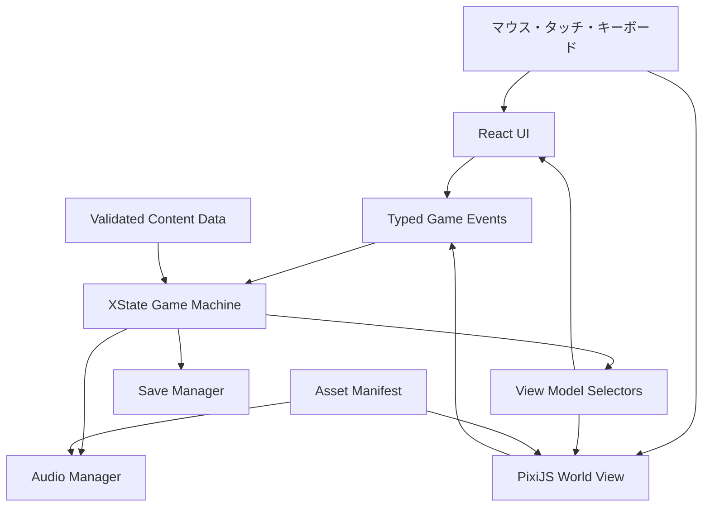

# 『ECHO ROOM / 残響室』技術設計書

## 1. 文書情報

| 項目 | 内容 |
|---|---|
| 文書種別 | 技術設計書 |
| 対象作品 | ECHO ROOM / 残響室 |
| 版 | 0.1 |
| 作成日 | 2026-08-11 |
| 入力資料 | `docs/base.md`、`docs/requirements.md` |
| グラフィック仕様 | `docs/graphics-production.md`、`docs/graphics-generation.yaml` |
| 実装計画 | `docs/implementation-plan.md` |
| 前提 | Web上で動作する、2D素材による一人称・疑似3D探索ゲーム |

本書では、要件を実現するための技術選定、構成、データ形式、実行時の責務、素材制作フロー、品質基準を定義する。具体的な画面デザインや台詞の最終稿は対象外とする。

---

## 2. 技術設計の結論

本作は、次の構成で実装する。

| 領域 | 採用技術 | 用途 |
|---|---|---|
| 言語 | TypeScript 5系（strict） | 全ロジックと画面実装 |
| 開発・ビルド | Vite 8系 | 開発サーバー、素材参照、静的配信用ビルド |
| UI | React 19系 | 字幕、会話、端末、所持品、設定、パズルUI |
| 空間描画 | PixiJS 8系 | 背景、前景、プロップ、疑似3D演出、画面効果 |
| ゲーム進行 | XState 5系 | 場面、会話、パズル、ロック状態の一元管理 |
| コンテンツ検証 | Zod | シーン、会話、パズル、保存データの形式検証 |
| サウンド | Web Audio API | 効果音、環境音、音量系統、フェード、ループ |
| 単体・結合テスト | Vitest | 純粋ロジック、進行、データ検証 |
| E2E・画像比較 | Playwright | 実ブラウザでの通しプレイ、表示、操作確認 |
| 配信方式 | 静的ホスティング | サーバー処理なしでゲームを配信 |
| 開発実行環境 | Node.js 24 LTS | ビルド、検証、テスト |
| パッケージ管理 | npm 11系 | 依存関係とlockfileの管理 |

### 2.1 この構成を採用する理由

- 本作の中心は物理演算や自由移動ではなく、レイヤー画像、視点切替、会話、状態変化である。
- PixiJSは描画部分に集中させ、ゲーム固有の進行を総合ゲームエンジンのSceneや内部状態へ閉じ込めない。
- 字幕、端末、所持品、設定は通常のHTML要素としてReactで実装し、文字の可読性、キーボード操作、スクリーンリーダー対応を確保する。
- XStateを唯一の進行判断元とし、「取得済みか」「何を聞いたか」「どのパズルが解けたか」を画面ごとに分散させない。
- コンテンツはデータとして管理し、台詞、画像、ホットスポット、条件、効果の変更を描画コードから分離する。
- 完成物は静的ファイルだけで配信でき、短編1人用ゲームに不要なサーバー運用を持ち込まない。

---

## 3. 代替案の比較

| 案 | 評価 | 判断 |
|---|---|---|
| Phaser単体 | 画像、入力、音、Scene管理が揃う。一方、本作では物理・タイル・ゲームループの多くを使わず、字幕や端末をCanvas内に寄せるとアクセシビリティ対応が重くなる | 不採用 |
| React + DOM/CSSのみ | 字幕やUIには強い。画像レイヤーも扱えるが、視差、フィルター、マスク、画面効果、描画負荷管理が増えるほど保守が難しい | 試作には可、本編は不採用 |
| Three.js + 平面板 | 2D画像を3D空間に置けるが、カメラ、奥行き、素材調整が実質的な3D制作工程になる | 固定条件に反するため不採用 |
| Unity WebGL | 制作機能は豊富だが、配布容量、初期化時間、HTML UIとの連携が本作規模に対して重い | 不採用 |
| PixiJS単体 | 空間描画には適するが、長文字幕、フォーム型パズル、アクセシビリティUIをすべてCanvasで作る負担が大きい | React併用で採用 |
| PixiJS + React + XState | 描画、UI、進行の責務を分けられ、疑似3Dと物語・謎解きの両方を拡張しやすい | 採用 |

### 3.1 採用しないもの

- 物理エンジン
- 3Dモデル、3Dカメラ、3D衝突判定
- バックエンドAPI、アカウント、オンライン保存
- 大規模なCMS
- マイク入力
- 任意コードを実行できるコンテンツスクリプト

必要性が発生するまで追加しない。

---

## 4. 対応環境

### 4.1 ブラウザ

- Chrome、Edge、Firefox、Safariの安定版および一つ前のメジャー版を対象とする。
- デスクトップを第一対象とする。
- タブレットとスマートフォンは横向きでプレイ可能にする。
- 縦向きではゲームを縮小表示せず、横向きへの変更案内を表示する。
- WebGL 2を基本描画方式とする。利用できない環境では対応外案内を表示する。
- WebGPUはPixiJSが選択可能でも初期リリースの必須条件にしない。

### 4.2 入力

- マウス
- タッチ
- キーボード

ゲームパッドは初期リリースの対象外とする。ただし、操作イベントを特定入力機器へ直結させず、将来追加できる構造にする。

### 4.3 基準画面

- 論理解像度は1920×1080、アスペクト比は16:9とする。
- 実画面には縦横比を維持して収め、余白はレターボックスで処理する。
- ノッチやブラウザUIを考慮した安全領域内に、字幕、戻る、設定などの必須UIを置く。
- 小さい画面ではUIを再配置し、単純な全体縮小で文字を読めなくしない。

---

## 5. システム構成



### 5.1 原則

1. ゲーム進行の正解はXStateの状態だけが持つ。
2. ReactとPixiJSは状態を勝手に変更せず、型付きイベントを送る。
3. 表示側はXStateから作られたView Modelを描画する。
4. 音声や保存は状態遷移の副作用として実行する。
5. コンテンツデータにJavaScript関数を埋め込まない。
6. 永続化対象と一時的な表示状態を分離する。

### 5.2 責務

#### React UI

- タイトル、ロード、設定
- 字幕、会話履歴
- 所持品、文書閲覧
- 端末
- 数字入力、並べ替えなどのパズルUI
- 一時停止、ヒント、確認ダイアログ
- スクリーンリーダー向けのライブ通知

#### PixiJS World View

- 背景と前景のレイヤー描画
- プロップの状態差分
- ホットスポットの位置とポインター反応
- 視点切替、接近、視差
- 非常灯、ノイズ、揺れ、フェードなどの演出
- 開発時のホットスポット可視化

#### XState Game Machine

- 現在の章、視点、フォーカス対象
- 会話中、探索中、パズル中、一時停止中などの排他的状態
- 所持品、確認済み情報、パズル進捗
- ロック解除条件
- イベントの受理可否
- エンディングまでの因果関係

#### 各サービス

- Audio Manager: 再生、停止、音量、フェード、再生状態
- Save Manager: 保存、読込、schema検証、破損時の復旧
- Content Loader: データ読込と検証
- Asset Loader: 場面単位の素材読込、解放、進捗通知
- Timer Service: アクティブプレイ時間と物語上の残り時間

---

## 6. 状態設計

### 6.1 最上位状態

```text
boot
  -> title
  -> loading
  -> playing
       intro
       puzzle_power_route
       puzzle_carrier_sync
       puzzle_maintenance_lock
       puzzle_signal_investigation
       puzzle_packet_repair
       puzzle_voiceprint_calibration
       puzzle_transmission_window
       transmission_ready
       ending_transmission
       ending_replay
       ending_door
  -> completed
  -> fatal_error
```

`playing`の内部には、次の並行状態を持たせる。

| 領域 | 状態例 |
|---|---|
| mode | exploring / dialogue / puzzle / document / paused |
| location | room_wide / desk / locker / terminal / breaker / intercom / door |
| overlay | none / inventory / settings / hint / confirmation |
| audio | locked / ready / suspended |

`mode`は排他的にし、会話中にパズル入力が通る、設定画面の裏で移動できる、といった競合を防ぐ。

### 6.2 永続化するゲーム状態

```ts
type GameProgress = {
  chapterId: ChapterId;
  locationId: LocationId;
  flags: Record<FlagId, boolean>;
  inventory: ItemId[];
  inspected: HotspotId[];
  solvedPuzzles: PuzzleId[];
  puzzleData: Record<PuzzleId, unknown>;
  heardDialogue: DialogueId[];
  unlockedHints: HintId[];
  activeElapsedMs: number;
};
```

保存しないものは、ポインター位置、アニメーション途中のフレーム、現在再生中の効果音、ホバー状態、開発用表示などである。

### 6.3 イベント

イベント名は「何が起きたか」を表し、画面部品名を含めない。

```ts
type GameEvent =
  | { type: 'GAME_STARTED' }
  | { type: 'HOTSPOT_SELECTED'; hotspotId: HotspotId }
  | { type: 'ITEM_SELECTED'; itemId: ItemId }
  | { type: 'ITEM_USED'; itemId: ItemId; targetId: HotspotId }
  | { type: 'DIALOGUE_ADVANCED' }
  | { type: 'PUZZLE_SUBMITTED'; puzzleId: PuzzleId; answer: unknown }
  | { type: 'HINT_REQUESTED'; hintId: HintId }
  | { type: 'PAUSED' }
  | { type: 'RESUMED' };
```

- 不正な状態で届いたイベントは無視し、開発時には診断ログを残す。
- 同じイベントの連続送信でアイテムが二重取得されないよう、遷移を冪等にする。
- 描画や音声の完了待ちは、一意の演出IDを付けた完了イベントで戻す。

---

## 7. 描画設計

### 7.1 画面レイヤー

各視点は次の順序で構成する。

```text
world
├── background       壁・床・天井
├── farProps         時計・遠景設備
├── mainProps        机・ロッカー・端末・ドア
├── foreground       ケーブル・画面手前の影
├── atmosphere       霧・埃・非常灯・ノイズ
├── transition       暗転・白飛び・視点移動
└── debug            ホットスポット・座標（開発時のみ）
```

- Z座標は使わず、コンテナ内の描画順で奥行きを表現する。
- レイヤーごとに基準位置から小さく異なる移動量を与え、ポインターまたは端末傾きに応じた視差を作る。
- 視差量は背景ほど小さく、前景ほど大きくする。
- 「画面が動くことで操作対象の座標がずれる」事故を防ぐため、ホットスポットは視差後の表示座標へ同期させる。
- 視差、揺れ、点滅は設定で軽減または停止できる。

### 7.2 視点遷移

- 基本は固定視点間の遷移とする。
- 通常移動は150〜350ms程度のパン、拡大、クロスフェードを組み合わせる。
- 重要演出以外では、入力を長時間ロックしない。
- 遷移中の重複入力は破棄するか、最後の一件だけを予約する。
- 動き軽減設定ではクロスフェード中心に置き換える。

### 7.3 ホットスポット

```ts
type HotspotDefinition = {
  id: HotspotId;
  label: string;
  shape: Polygon | Rectangle;
  inspectionOutline: Polygon | Rectangle | Ellipse;
  cursor: 'inspect' | 'move' | 'use';
  visibleWhen?: Condition[];
  enabledWhen?: Condition[];
  action: ContentAction;
  focusOrder: number;
};
```

- 座標は論理解像度に対する正規化値で持つ。
- 矩形だけでなく多角形を利用できる。
- ポインター向け領域は見た目より少し広くし、タッチ時の最小選択寸法を確保する。
- 操作判定用polygonと調査開始時の演出用輪郭は同じHotspot View Model内で別に持つ。演出用輪郭は機器類の四角形、時計の円、机の台形など、対象に合う単純な形とし、左上と右下を起点に約75msで同時描画する。判定用polygonは可視化しない。
- キーボード操作時はフォーカス輪郭と対象名を表示する。
- PixiJSと同じHotspot View ModelからReactのDOMオーバーレイを生成し、各対象へ名前、役割、フォーカス順を与える。
- ReactのUIとPixiJSのホットスポットが同時に入力を受けないよう、モーダル表示中はWorld Viewの入力を停止する。

### 7.4 プロップの差分

1つの物体に対して、状態別画像または追加レイヤーを定義する。

```yaml
id: terminal
states:
  off:
    texture: terminal/off.webp
  booting:
    texture: terminal/on.webp
    effect: screen_flicker
  on:
    texture: terminal/on.webp
  panel_open:
    texture: terminal/panel_open.webp
```

状態名はコンテンツ側で定義してよいが、存在しない画像参照や到達不能な状態はビルド時に検出する。

### 7.5 CanvasとDOMの重ね方

```text
app-root
├── canvas-layer        PixiJS
├── hotspot-a11y-layer  PixiJS accessibility overlay
├── hud-layer           React
├── modal-layer         React
└── system-layer        React: loading/error/orientation
```

- Canvasは空間表現に限定し、長文をCanvasテキストとして描画しない。
- React UIは論理画面の安全領域へ合わせる。
- モーダル表示中は背景を`aria-hidden`相当にし、フォーカスをモーダル内へ閉じ込める。

---

## 8. コンテンツ設計

### 8.1 方針

- 会話、シーン、パズル、アイテム、ヒント、素材一覧をコードから分離する。
- 人が編集する原本はYAMLとする。
- 読込時にはZodで検証し、リリースビルド前にも全データを一括検証する。
- ID参照の存在、重複、到達不能、PACKETと字幕の対応、20分差を追加検証する。
- 条件と効果は許可した命令だけを使い、任意スクリプトは埋め込まない。

### 8.2 ディレクトリ案

```text
src/
├── app/                 起動と依存関係の組み立て
├── game/
│   ├── machine/         XState定義、guards、actions
│   ├── domain/          ID、状態、イベント、純粋ロジック
│   ├── content/         読込、schema、参照検証
│   ├── puzzles/         パズル種別ごとの判定
│   ├── save/            保存形式、検証
│   └── selectors/       View Model生成
├── world/
│   ├── renderer/        PixiJS初期化
│   ├── scenes/          レイヤーとホットスポット
│   ├── effects/         視差、照明、ノイズ、遷移
│   └── assets/          Asset Loader
├── ui/
│   ├── dialogue/
│   ├── terminal/
│   ├── inventory/
│   ├── puzzles/
│   ├── settings/
│   └── accessibility/
├── audio/
├── content/             YAML原本
└── styles/

public/
└── assets/
    ├── manifests/
    ├── images/
    ├── audio/
    └── fonts/

tests/
├── unit/
├── integration/
├── e2e/
└── visual/
```

### 8.3 シーン定義例

```yaml
id: room_wide_emergency
logicalSize: [1920, 1080]
bundle: room_emergency
layers:
  - id: background
    asset: room/wide/background.webp
    parallax: 0.01
  - id: desk
    asset: room/wide/desk.webp
    parallax: 0.025
  - id: foreground
    asset: room/wide/foreground.webp
    parallax: 0.04
hotspots:
  - id: breaker
    label: ブレーカーを調べる
    polygon: [[0.08, 0.23], [0.23, 0.22], [0.24, 0.76], [0.07, 0.78]]
    enabledWhen:
      - flagIs: power_restored
        value: false
    action:
      openPuzzle: emergency_power
```

### 8.4 会話定義例

```yaml
id: intercom_first_contact
blocking: true
lines:
  - speaker: future_protagonist
    text: ……聞こえるか？
    effects: [intercom_noise]
  - speaker: protagonist
    text: 誰だ？
effectsOnComplete:
  - setFlag: first_contact_complete
  - setObjective: restore_power
```

- 台詞データは発話音声ファイルを参照しない。
- 通信時は字幕と通信ノイズを同期させるが、サウンド終了を進行条件にしない。
- 台詞の表示時間は文字数から初期値を算出して個別調整できる。

### 8.5 条件と効果

条件は次の組み合わせに限定する。

- フラグが指定値か
- アイテムを所持しているか
- パズルが完了しているか
- 会話または対象を確認済みか
- 現在の章が指定値か

効果は次の組み合わせに限定する。

- フラグ変更
- アイテム取得・消費
- 会話開始
- パズル開始
- 視点移動
- プロップ状態変更
- 音声・演出再生
- 目的更新
- 章進行

条件式が複雑になった場合も、YAML内にプログラム式を書かず、名前付きのguardとしてコード側へ切り出す。

---

## 9. パズル基盤

### 9.1 共通契約

```ts
interface PuzzleDefinition<TState, TAnswer> {
  id: PuzzleId;
  kind: PuzzleKind;
  initialState: TState;
  validateAnswer(answer: TAnswer, progress: GameProgress): PuzzleResult;
  hints: HintId[];
}

type PuzzleResult =
  | { status: 'correct'; effects: ContentEffect[] }
  | { status: 'incorrect'; feedbackId: string; reset: 'none' | 'partial' | 'all' }
  | { status: 'blocked'; reasonId: string };
```

- 判定処理は描画や音声を直接操作しない純粋関数にする。
- 正解時の世界変化は`effects`としてゲームマシンへ返す。
- 誤答回数はヒント解禁に利用できるが、評価やエンディング分岐には使わない。
- 開発時には任意のパズル開始状態へ移動できるデバッグ導線を用意する。

### 9.2 本編のパズル種別

| パズル | 種別 | 主なUI | 判定 |
|---|---|---|---|
| 非常電源経路 | routing | 通電表示付き配線・コネクタ・物理ブレーカー | 隔離対象と3設備の給電順 |
| 搬送波同期 | calibration | 基準へ直接dragする波形レール | 3回線の位相補正 |
| ロッカー | correlation | 4つの記号ダイヤル・ハンドル | 点検順から変換した4記号 |
| 通信記録と配線 | routing | RECEIVE/SOURCEの接続部と施設図 | 3対応、20分差、線種、中継端子、送り先 |
| PACKET復元 | reconstruction | 固定HEADER・端形状付きデータ片・連続性レール | 4断片の連続順 |
| 声紋校正 | calibration | 波形画面・ダイヤル・スライダー | 3特徴の逆変換 |
| 送信設定 | routing | 本文付き受信枠・試験レバー | 会話順、4受信枠、時間差、送り先 |

### 9.3 装置操作と判定境界

- `PuzzleDevice`は`puzzleId`から装置固有componentを一つだけ選び、共通のtask・選択肢フォームを生成しない。
- 各装置componentは一時的な物理操作状態だけを持ち、証拠、解法、正解表を画面へ列挙しない。
- XStateへ送るeventは`PUZZLE_SUBMITTED { puzzleId, answer[] }`へ統一する。
- 正解表はUI componentに持たせず、`isPuzzleAnswerCorrect`純粋関数だけが参照する。
- 波形同期など正しい連続状態を装置が検出できる問は自動送信し、ロッカーと送信試験は世界内のハンドル・レバーで送信する。
- 誤答時は進行状態を変更せず、装置固有の安全な反応を返す。PACKET復元のように誤り箇所を直す問は配置を保持し、保護回路が戻す装置だけ一時操作を初期化する。
- 正誤の主要feedbackは発光、断線、レバー復帰、ハンドル停止と短い状態codeを併用し、長い説明文で機械に解法を喋らせない。
- 正解時は完了IDと次の`StoryStage`だけをXState contextへ反映する。
- 装置ごとの専用machineは作らず、共通進行machineと純粋判定を単一境界として維持する。

### 9.4 波形の共通文法

- 横軸は常に時間とし、同じ線高・短長・節点は同じ特徴を表す。
- 搬送波、PACKET指紋、声紋特徴量の三用途だけに限定する。
- HTML/CSSの線高と同じ内容を数列・短長表現でも表示する。
- 音声再生、色、animationの有無は正解判定へ影響させない。

---

## 10. サウンド設計

### 10.1 サウンド系統

```text
master
├── environment
└── effects
```

- environmentとeffectsは0〜100の設定値を持ち、最終音量はmasterとの積で求める。voice系統は作らない。
- ページ非表示または一時停止で全サウンドを停止する。
- 環境音はシームレスループし、視点移動では原則として継続する。

### 10.2 ブラウザ制約への対応

- 初回の「ゲーム開始」操作をWeb Audio開始のユーザージェスチャーとして使う。
- サウンドが開始できなくても、字幕と視覚フィードバックだけで進行可能にする。
- サウンドの読込完了をゲーム進行の必須条件にしない。

### 10.3 素材形式

- 現行本編の環境音・効果音はWeb Audio APIのoscillatorとgainで手続き生成し、`SoundManager`のcue registryへ集約する。外部音声ファイル、別player、Audio Spriteは併存させない。
- 非常電源中と電源復旧後の機械ハムをenvironment busでループし、共通UI click、話者差のないtext blip、通信ノイズ、接続、回路、電源、ロック、解析、送信、ドア解錠をeffects busの短いcueとして生成する。
- text blipは字幕速度に同期して句読点を避けながら間引き、`performance.now()`基準の文字送り表示と合わせる。早押しでは全文表示まで、動き軽減では文字送りとblipを省略する。
- 将来、手続き音を外部素材へ置き換える場合だけ、制作原本は非圧縮WAV、配信用はOpus系とAAC系を比較し、同じcue IDと単一Sound Manager境界を維持する。
- 発話音声として解釈できる素材はmanifestに登録しない。

### 10.4 声紋演出

- PACKETには発話文と声紋特徴量がデータとして含まれる。
- プレイヤーが間隔、包絡、位相の三特徴を職員記録の基準へ校正する。
- 全特徴が一致した結果としてE-01 OCCUPANTと主人公写真を表示する。自動解析率だけで進行させない。
- 発話音声の聞き比べ、加工解除、演者の同一性には依存しない。

---

## 11. 時間管理

### 11.1 方針

要件書の推奨に従い、20分経過を即ゲームオーバーにはしない。時計は緊張感と物語理解のために使い、操作速度の遅いプレイヤーを排除しない。

### 11.2 計測

- `performance.now()`を用いてアクティブプレイ時間を計測する。
- 一時停止、設定、ブラウザが非表示の間は加算しない。
- 壁時計の02:17は固定の物語情報であり、バッテリー残量とは別に扱う。
- バッテリー表示は00:19:48から減算する。
- 00:00到達時は非常予備電源へ切り替わる演出を出すが、進行は継続できる。
- 予備電源中は照明や環境音を弱め、ヒント利用可能の通知を出せる。
- セーブにはアクティブプレイ時間と、予備電源移行済みかを保存する。

この扱いによって、物語上の「約20分」という緊迫感と、初見20〜30分という想定プレイ幅を両立する。厳密な因果時間は会話・送信ログの時刻で保証する。

---

## 12. 保存設計

### 12.1 保存方式

- `localStorage`へJSONとして保存する。
- 保存枠は「続きから」用の1枠と、設定用の1枠とする。
- 保存は主要イベント完了、アイテム取得、パズル正解、章移動、設定変更の直後に行う。
- 書込失敗はゲーム進行を止めず、保存できない旨を通知する。

### 12.2 保存形式

```ts
type SaveDataV4 = {
  schemaVersion: 4;
  contentVersion: string;
  savedAt: string;
  progress: {
    checkpointId: CheckpointId;
    powerRestored: true;
    storyStage: StoryStage;
    locationId: LocationId;
    inventory: ItemId[];
    completedPuzzleIds: PuzzleId[];
    puzzleFailures: Record<PuzzleId, number>;
    endingLineIndex: number;
    hintLevel: number;
    activeElapsedMs: number;
    reservePower: boolean;
  };
};
```

- XState内部snapshotをそのまま保存せず、明示したドメインデータだけを保存する。
- 読込時はZodで検証する。
- 現行の進行schema v4と`contentVersion`だけを受理し、旧10問形式の変換・読込分岐を実装しない。
- 非対応versionまたは破損時はデータを上書きせず、新規開始と消去を選べるようにする。
- 設定データは進行データと分け、最初からやり直しても保持する。現行の設定schema v4は字幕・SOUND master・効果音・環境音・視覚補助・動き軽減と冒頭会話の既読状態を持つ。

### 12.3 再開

- 保存された細かな表示途中ではなく、直近の安全なチェックポイントから再構築する。
- 再開時に音声や取得演出を二重再生しない。
- 現在の目的、取得物、既読ログは保存直後の状態と一致させる。

---

## 13. 素材管理

グラフィックの世界観、制作寸法、レイヤー納品形式、個別生成プロンプト、参照画像の依存順は`docs/graphics-production.md`および`docs/graphics-generation.yaml`を正本とする。

### 13.1 画像

- 制作原本はレイヤーを保った編集可能形式で管理する。
- 配信用画像は原則WebPとし、透明境界や画質に問題がある素材だけPNGを使う。
- 1枚の巨大背景に全状態を焼き込まず、変化する物体を独立レイヤーにする。
- 同じ画像の重複書き出しを避け、共有可能な素材は共通IDで参照する。
- 最大テクスチャ寸法は対象端末で検証し、原則4096px以内に分割する。
- 1920×1080表示で必要以上の解像度を配信しない。

### 13.2 Asset Manifest

```ts
type AssetBundle = {
  id: string;
  preload: boolean;
  images: AssetRef[];
  sounds: SoundAssetRef[];
  dependsOn?: string[];
};
```

- `boot`: ロゴ、ロード表示、基本フォント
- `title`: タイトル背景、開始音
- `room_emergency`: 暗い室内、非常灯、通信ノイズ
- `room_powered`: 点灯後の室内、端末、ロッカー
- `reveal`: 声紋データ解析と最終装置
- `ending`: 白飛び、タイトル、終幕効果音

最初に全素材を読み込まず、現在のbundleと次に必要なbundleを優先する。

### 13.3 読込失敗

- 必須素材は回数制限付きで再試行する。
- 装飾素材の失敗ではゲームを継続する。
- 背景、必須UI、進行に必要な字幕データが取得できない場合は、再読込できるエラー画面を表示する。
- 壊れた素材ID、URL、発生場面を診断ログへ残す。ただしプレイヤーの保存内容は外部送信しない。

---

## 14. 性能設計

### 14.1 目標

基準環境は、一般的な4年前程度のノートPCと中位スマートフォン、10Mbps・遅延50ms程度の通信とする。

| 指標 | 目標 |
|---|---|
| タイトル表示 | 初回アクセスから2.5秒以内を目標 |
| ゲーム開始 | 開始操作から主要室内表示まで5秒以内を目標 |
| 描画 | 通常60fps、低性能端末で安定30fps以上 |
| 入力反応 | 通常操作から視覚反応まで100ms以内 |
| 初期転送量 | タイトルまで1MB以下を目標 |
| 最初の操作可能場面 | 累計8MB以下を目標 |
| 全編素材 | 40MB以下。環境音・効果音は手続き生成のため追加転送量なし |

### 14.2 対策

- 画面外・非表示レイヤーを描画対象から外す。
- 静止場面では毎フレーム更新が必要な処理を限定する。
- 画像を場面単位で読み込み、不要になった大容量textureを解放する。
- スプライトの描画順とtexture切替を整理する。
- 高密度画面でも描画解像度へ上限を設ける。
- 点滅、ノイズ、視差の品質設定を用意する。
- リリース前に実素材を使用してGPUメモリを測定し、サウンドは生成nodeがpause・終了時に解放されることを測定する。

---

## 15. アクセシビリティ実装

- 字幕、端末、所持品、設定は意味を持つHTML要素で実装する。
- 探索対象にはPixiJSと同じHotspot View Modelを使うReactのDOMオーバーレイを使用する。
- 重要な状態変化は`aria-live`領域へ短く通知する。
- キーボードだけで全必須操作を完了できる。
- フォーカス順は画面内の視覚的な並びと一致させる。
- 色だけで正誤、ロック、選択を伝えない。
- 波形は線高と同じ内容を数列・短長表現でも示す。
- `prefers-reduced-motion`を初期値へ反映し、設定で上書き可能にする。
- 字幕サイズ、背景、話者名表示、音量系統を設定可能にする。
- ゲーム画面の拡大縮小時にも、字幕や操作UIが欠けないことを確認する。

Canvas内の見た目とDOM上のアクセシブルな要素が食い違わないよう、どちらも同じHotspot View Modelから生成する。

---

## 16. エラー処理と診断

### 16.1 プレイヤー向け

- 初期化失敗: 再読込、対応環境案内
- 素材読込失敗: 再試行、音声のみ失敗時は字幕継続
- 保存失敗: プレイを継続し、保存できていないことを通知
- 保存破損: 新規開始、保存削除を選択
- 描画機能不足: 対応ブラウザ・端末の案内

技術的なスタックトレースはプレイヤー画面に表示しない。

### 16.2 開発用診断

- 現在のmachine state、flags、inventory
- 最後に受理・拒否したイベント
- 読込済みasset bundle
- 再生中の音声と音量系統
- ホットスポット境界とID
- FPS、texture数、概算メモリ
- 任意の章・パズルへの移動

開発用機能は本番ビルドで無効化する。

---

## 17. セキュリティとプライバシー

- ゲーム本編はサーバー通信なしで成立させる。
- 台詞や資料をHTML文字列として直接挿入せず、通常のテキストとして描画する。
- Content Security Policyを設定し、外部スクリプトとインラインスクリプトを原則禁止する。
- 保存データは進行と設定だけに限定し、個人情報を保存しない。
- マイク、カメラ、位置情報などの権限を要求しない。
- 外部分析を導入する場合は別途合意を必要とし、本設計には含めない。
- 依存パッケージの固定ファイルをコミットし、定期的に脆弱性を確認する。

---

## 18. テスト設計

### 18.1 コンテンツ検証

ビルド前に次を自動検証する。

- IDの重複と存在しない参照
- 使用されない必須素材
- 存在しない画像・サウンドファイル
- 発話音声参照が会話データやmanifestに混入していないか
- 受信時刻と送信時刻が正確に20分差か
- PACKET 01〜04の文言と冒頭・終盤の一致
- 到達不能な章、会話、パズル
- 必須アイテム取得前にしか実行できない使用イベント
- 全パズルに正解、誤答反応、完了効果があるか

### 18.2 単体テスト

- 各パズルの正解、誤答、再試行
- 条件と効果の評価
- 所持品の取得・使用の冪等性
- View Model selector
- タイマーの停止・再開・00:00到達
- 保存データ検証と非対応versionの保護
- 字幕表示時間の算出

進行ロジックは外部時間、描画、音声から分離し、決定的にテストできるようにする。

### 18.3 状態遷移テスト

- 正規ルートで導入からcompletedへ到達できる。
- 必須イベントを飛ばして先へ進めない。
- 各チェックポイントから再開できる。
- 誤答、重複入力、戻る操作を挟んでも進行不能にならない。
- 一時停止中にタイマーと入力が進まない。
- サウンド失敗時も字幕と視覚補助で進行できる。

### 18.4 E2Eテスト

Playwrightで次を確認する。

- 新規開始からエンディングまでの最短通しプレイ
- 保存後の再読込と続きから再開
- キーボードのみの通しプレイ
- 聴覚補助を使った非常電源パズル
- 各対象ブラウザの主要操作
- デスクトップ、タブレット横、スマートフォン横の表示
- 縦向き案内
- 字幕拡大、動き軽減、各音量設定

### 18.5 Visual Regression Test

- 各視点の通常状態と主要な変化後をスクリーンショット比較する。
- 端末、所持品、字幕、設定、各パズルの代表状態を比較する。
- 画像差分はCanvasだけでなくDOM UIを含む全画面で確認する。
- 点滅、ノイズ、時刻はテスト時に固定し、差分を決定的にする。

---

## 19. CIとリリース

### 19.1 必須チェック

1. 依存関係の再現可能なインストール
2. TypeScript型検査
3. lintと整形確認
4. コンテンツ・素材参照検証
5. 単体・状態遷移テスト
6. 本番ビルド
7. Playwrightの主要通しテスト
8. 配信容量予算の確認

### 19.2 配信

- Viteの本番出力を静的ホスティングへ配置する。
- ファイル名にハッシュを付け、長期cacheを利用する。
- `index.html`とasset manifestは更新確認しやすい短いcacheにする。
- 配信先がサブパスの場合でも動作するようbase pathを設定可能にする。
- リリースごとに`contentVersion`を更新する。
- 非対応versionを誤読・上書きしないテスト後に公開する。

### 19.3 ロールバック

- 直前の静的成果物へ戻せるよう、リリース単位で成果物を保持する。
- 保存形式を変更したリリースでは、旧版へ戻した場合の互換性を事前に確認する。
- 新版が保存データを不可逆に書き換える場合は、公開前にバックアップ形式を保存データ内へ持たせる。

---

## 20. 実装順序

### Phase 1：技術試作

- PixiJS CanvasとReact UIの重ね合わせ
- 1920×1080基準の拡縮と横向き対応
- 3レイヤーの室内と視差
- 1つのホットスポットをマウス、タッチ、キーボードで操作
- 通信ノイズと字幕
- XStateから両表示を更新

**完了条件:** 仮素材の机を選択し、接近、台詞表示、戻るまでを全入力方式で行える。

### Phase 2：縦切りプロトタイプ

- 導入
- 非常電源パズル
- 電源復旧による画像・照明・端末状態変化
- セーブと再開
- 音の視覚補助

**完了条件:** ゲーム開始から端末起動までを、本番に近い品質で通して確認できる。

### Phase 3：全進行の実装

- 全章と全パズルを仮素材・仮サウンドで実装
- 正規ルート、誤答、戻る、再開を検証
- コンテンツ検証をCIへ導入

**完了条件:** 仮素材でも冒頭からエンディングまで進行できる。

### Phase 4：本素材と演出

- 本番画像、環境音、効果音、字幕
- 視差、ノイズ、声紋、送信、白飛び演出
- asset bundleと性能調整

### Phase 5：品質調整

- ブラウザ・画面サイズ確認
- アクセシビリティ確認
- ヒントと難易度調整
- 初見プレイテスト
- 容量、読込、保存schema検証、E2E確認

---

## 21. 技術上の受け入れ条件

1. 3Dモデルなしで、複数レイヤーの2D画像から一人称の立体的な室内を表示できる。
2. マウス、タッチ、キーボードで同じ必須進行を完了できる。
3. React UIとPixiJS描画が、同じゲーム状態から矛盾なく更新される。
4. すべての進行変更が型付きイベントを経由し、表示部品が進行状態を直接変更しない。
5. 全コンテンツデータと素材参照がリリース前に自動検証される。
6. サウンドが再生できない場合も字幕と視覚補助で最後まで進行できる。
7. 保存後の再読込で、安全なチェックポイントから状態を復元できる。
8. パズルの誤答、連打、画面移動、再読込で進行不能にならない。
9. 動き軽減、音の視覚補助、字幕調整が全編で機能する。
10. 対象ブラウザと横向き端末で、性能目標と表示要件を満たす。
11. 静的ファイルだけで配信でき、マイクその他の端末権限を要求しない。
12. 本番ビルドに開発用の状態変更機能や診断画面を含めない。

---

## 22. 残課題と試作で検証する事項

| ID | 課題 | 検証方法 | 決定時期 |
|---|---|---|---|
| T-01 | 疑似3Dの視差量 | 仮背景3層で酔いと立体感を比較 | Phase 1 |
| T-02 | PixiJSアクセシビリティオーバーレイと多角形ホットスポットの整合 | キーボード、拡大、画面回転で確認 | Phase 1 |
| T-03 | スマートフォン横向きでの字幕と端末UI | 代表的な小型画面で実寸確認 | Phase 1 |
| T-04 | サウンド開始操作とSafariの再生制約 | iOS Safari実機で開始・復帰を確認 | Phase 2 |
| T-05 | バッテリー00:00後の演出 | 初見テストで緊迫感が失われないか確認 | Phase 2 |
| T-06 | YAML編集の使いやすさ | 台詞修正とパズル追加を非実装担当者にも試してもらう | Phase 3 |
| T-07 | 全サウンドを含む配信容量 | 手続き生成へ確定し追加転送量なし。node停止をunit・全編E2Eで検証 | Phase 4完了 |
| T-08 | 声紋データ照合が正体の発見として機能するか | 声紋数値・人物写真・正体判明台詞を初見テスト | Phase 4 |

---

## 23. 依存技術の採用基準と更新方針

- major versionは設計開始時点で固定し、minor・patchはテスト通過を条件に更新する。
- lockfileを必ず管理する。
- Node.jsはCurrentではなくLTSを使用する。2026-08-11時点では24系を基準とする。
- PixiJSは8系、XStateは5系を採用し、major更新は作品公開中に自動適用しない。
- 依存追加時は、用途、代替、bundle増加、保守状況、ライセンスを記録する。
- 同じ目的のライブラリを重複導入しない。
- 年4回または公開前に依存関係と脆弱性を確認する。

---

## 24. 参考資料

- [PixiJS Architecture](https://pixijs.com/8.x/guides/concepts/architecture)
- [PixiJS Application](https://pixijs.com/8.x/guides/components/application)
- [PixiJS Accessibility](https://pixijs.com/8.x/guides/components/accessibility)
- [Vite Static Asset Handling](https://vite.dev/guide/assets.html)
- [Vite 8 Announcement](https://vite.dev/blog/announcing-vite8)
- [React: Using TypeScript](https://react.dev/learn/typescript)
- [React Versions](https://react.dev/versions)
- [XState documentation](https://stately.ai/docs)
- [XState persistence](https://stately.ai/docs/persistence)
- [Web Audio API](https://developer.mozilla.org/docs/Web/API/Web_Audio_API)
- [Zod JSON Schema](https://zod.dev/json-schema)
- [Vitest Coverage](https://vitest.dev/guide/coverage.html)
- [Playwright Assertions](https://playwright.dev/docs/test-assertions)
- [MDN: Autoplay guide](https://developer.mozilla.org/en-US/docs/Web/Media/Guides/Autoplay)
- [Node.js Releases](https://nodejs.org/en/about/previous-releases)
